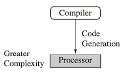
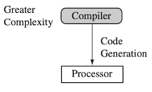
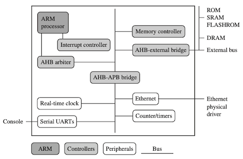
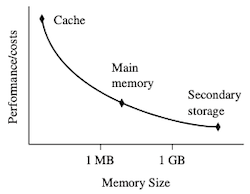
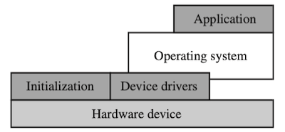
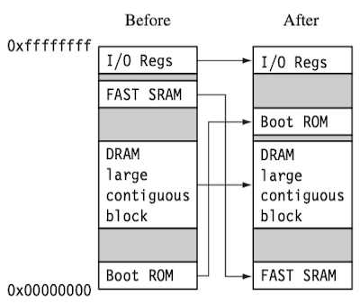

# 1 ARM Embedded System

> ARM core는 core만이 아니라, 일관된 설계 원칙과 공통적인 명령어 집합을 공유하는 설계 집합을 의미한다.

> [RISC-V 정리 문서(Computer Organization and Design RISC-V Edition)](https://github.com/erectbranch/Computer_Organization_and_Design)

아키텍처에서 사용하는 instruction set은, 대표적으로 **RISC**와 **CISC**의 두 가지 design philosophy로 구분된다.

|| CISC (Complex Instruction Set Computer) | RISC (Reduced Instruction Set Computer) |
| --- | --- | --- |
||  |  |
| complexity | 명령어 복잡 HW에 의존 | 명령어 단순 컴파일러(SW)에 의존 |
| \#instructions | 많음 | 적음 |
| instruction size | 가변적 | 고정 |
| \#registers | 적음 | 많음 |

---

## 1.1 RISC Design Philosophy

ARM은 **RISC** 구조를 갖는다. RISC는 1 clock 내 실행되는 단순하고 빠른 명령어가 주된 특징이다. RISC는 다음 4가지 대표적인 설계 원칙을 기본으로 한다.

| 설계 원칙 | 특징 | CISC와 비교 |
| --- | --- | --- |
| **instructions** | - 고정 크기(bits)로 구성  - 1 cycle 내 수행되는 단순한 연산 위주 설계  (나눗셈 등 복잡한 연산은, 단순한 연산을 조합해서 구현) | CISC는 가변 크기 명령어를 갖고, 여러 사이클에 걸쳐 실행 (또한, **microcode**라는 보다 작은 단위로 세분화된다.)
| **pipelines** | - 명령어를 병렬적으로 실행  - 1 cycle에 한 단계씩 진행 | microcode 등 miniprogram 단위로 실행 |
| **registers** | - 다수의 범용 레지스터로 구성 - 데이터 혹은 메모리 주소를 포함 | 반면, CISC는 목적에 따라서 레지스터를 소유 (e.g., `AX`(Accumulator), `BX`(Base address), `CX`(Count), `DX`(Data), ...) |
| **load-store architecture** | - 피연산자(operand)는 반드시 레지스터에 적재되어 있어야 한다. - 레지스터 뱅크와 메모리 사이 데이터는, `load`/`store` 명령을 통해 전송 | CISC는 operand가 메모리에 있어도 무방하다. |

---

## 1.2 ARM Design Philosophy

ARM 아키텍처는 RISC의 설계 원칙을 따르며, 다음과 같은 특징을 갖는다.

| 특징 | 설명 |
| --- | --- |
| **variable cycle execution for certain instructions** | 실행 사이클이 가변적인 일부 명령어를 제공 (e.g., load-store-multiple) |
| **inline barrel shifter** | 명령어를 보다 복잡하게 수행 가능 |
| **Thumb mode** | 16-bit 명령어 집합을 제공한다. (code density 면에서 32-bit 대비 30% 이상 유리) |
| **conditional execution** | 고비용의 branch instruction 대신 사용하여 최적화 가능 |
| **DSP(Digital Signal Processor)** 확장 명령 | 신속한 16x16 multiplier/saturation를 제공 |

> 참고로, ARM 디버깅은, 내장된 ICE(In-Circuit Emulator)를 사용하여 trap(interrupt)을 발생시킨다.

---

## 1.3 Embedded System Hardware

다음은, ARM 기반 임베디드 장치(microcontroller)의 구성 요소를 나타낸 그림이다.

| 구성 요소 | 설명 |
| --- | --- |
| **ARM processor** | 명령어 실행 엔진인 core bus를 통해 직접 인터페이스하는 컴포넌트와 함께 구성(e.g., cache, MMU) |
| **controller** | 중요한 시스템 기능을 제어(e.g., interrupt controller, memory controller) | 
| **peripherals** | 칩 외부와의 입출력을 제공 |
| **bus** | 서로 다른 컴포넌트 간 통신에서 사용 |

> MMU(Memory Management Unit): 가상 주소를 물리 주소로 변환하는 장치

---

### 1.3.1 ARM Bus Technology

ARM 임베디드 시스템에서는 internal on-chip bus를 통해 주변장치(peripherals)와 연결된다. (이때 core와 주변장치는 마스터-슬레이브 관계로 bus와 연결된다.)

> 반면 x86 PC의 경우, external off-chip bus인 PCI(Peripheral Component Interconnect) bus를 주로 사용한다.

| 종류 | 설명 |
| --- | --- |
| bus master(ARM core) | 데이터 전송을 개시할 수 있다. |
| bus slave | master에 데이터 전송에 응답할 수 있다.(응답만 가능) |

> 참고로 bus는 2단계 아키텍처 레벨을 가지며, 각 레벨은 다음과 같이 역할이 구분된다.
> 
> | level | 설명 |
> | --- | --- |
> | 물리 단계(physical level) | electrical characteristics 및 bus width(16, 32, 64 bits) |
> | 프로토콜 단계(protocol level) | 프로세서와 주변장치 사이의 통신 규칙(protocol) |

---

### 1.3.2 AMBA Bus Protocol 

1996년 ARM에서 도입한 **AMBA**(Advanced Microcontroller Bus Architecture)은, 각기 다른 프로세서 아키텍처에서도 주변장치 설계를 재사용할 수 있도록 한 standard bus protocol이다.

AMBA는 세 가지 버스 설계로 구성된다.

- **AHB**(ARM High-performance Bus): 고성능 주변장치용 버스

  (ASB 같은 양방향 아닌) 중앙 집중형 다중 버스 방식. 64, 128 bits 버스폭을 허용하며, 높은 throughput을 제공한다.

- **APB**(ARM Peripheral Bus): 저성능 주변장치용 버스

- **ASB**(ARM System Bus)

> 참고로, AHB는 두 가지 변형이 존재한다. 서로 protocol은 같으나 interconnect가 다르다.
>
> - interconnect: bus, ring, mesh 등 연결 형태
> 
> | bus 기법 | 설명 | 기타 |
> | --- | --- | --- |
> | Multi-layer AHB | 다중 버스 마스터 허용 | multi-processor에 적합 |
> | AHB-List | 단일 버스 마스터 제한 | AHB의 subset에 해당 |

---

### 1.3.3 Memory

다음은 각 memory hierarchy(메모리 계층) 내 메모리의 장단점을 비교한 그래프와 도표이다.

- 프로세서 코어에 가까운 메모리일수록, 성능은 우수하나, 비용은 높고 용량은 작다.

  

| 메모리 계층 | 크기 예 | 구현 예 | 특징 |
| --- | --- | --- | --- |
| **cache** | ~16MB | On-chip/SRAM | - 메모리 접근 overhead를 줄이며 성능을 향상시킨다. - (-) 예측이 어려운 까닭에, **real-time system response에 도움이 되지 않는다.** |
| **main memory** | ~16GB  | DRAM | load/store 명령을 통해 접근 | 
| **secondary storage** | 100GB~ | HDD, CDR, NAND flash | |

다음은 임베디드 시스템에서 사용되는, 대표적인 메모리를 종류별로 정리한 도표이다.

| 메모리 종류 | 읽기/쓰기 가능 여부 | 특징 |
| --- | --- | --- |
| ROM(Read-Only Memory) | X (변경 불가) | - 주로 boot loader, firmware 등 저장에 사용 |
| Flash ROM | O | - 대용량 저장 장치 대체 - 쓰기가 매우 느리며, 전적으로 SW가 제 |
| DRAM(Dynamic Random Access Memory) | O | - 주기적인 refresh가 필요 - 별도의 컨트롤러가 필요 |
| SRAM(Static Random Access Memory) | O | - 주로 cache, 고속 메모리 용도로 활용 - refresh 불필요하지만, DRAM보다 더 넓은 면적 필요 |
| SDRAM(Synchronous DRAM) | O | - 프로세서 버스와 동기적으로 작동 - 셀에서 읽힌 후 파이프라인 방식으로 버스에 burst |

---

#### 1.3.3.1 Memory Width

bit width는 성능 및 비용에 직접적인 영향을 미치는 요소로, 일반적으로 8, 16, 32, 64 bits를 사용한다. 

> ARM 프로세서에서는 16 bit **Thumb** 명령어를 제공하며, 이를 16-bit-wide 메모리와 조합할 수 있다. 

다음은 ARM 32-bit와 Thumb 16-bit 명령어의 fetch 사이클을, 다양한 bit-wide 메모리에서 비교한 도표다.

| instruction size | 8-bit memory | 16-bit memory | 32-bit memory |
| --- | --- | --- | --- |
| ARM 32-bit | 4 cycles | 2 cycles | 1 cycle |
| Thumb 16-bit | 2 cycles | 1 cycle | 1 cycle |

---

### 1.3.4 Peripheral Devices

주변장치는 다른 off-chip 장치나 센서와 연결되어, chip에 대해 입출력 기능을 수행한다. 

> 간단한 serial communication 장치부터, 복잡한 무선 장치 등 다양

- 모든 ARM 주변장치는 **memory-mapped I/O**, 즉 메모리에 mapping되어 있다.

  메모리 주소를 가진 레지스터 집합을, 프로그래밍 인터페이스로 사용한다. (레지스터 메모리 주소는 해당 주변장치의 base address에서 offset 기반으로 계산된다.)

  > 예를 들어, 이더넷 컨트롤러의 status, buffer, control register 등이 메모리 주소에 매핑된다.

  > 반대는 I/O-mapped 방식으로, I/O 장치 전용 명령어를 갖는다. (e.g., inb, outb) (Intel)

주변장치 중 **controller**(메모리, 인터럽트 컨트롤러)는 특수 목적 주변장치에 해당된다.

| 종류 | 설명 |
| --- | --- |
| memory controller | - 다양한 유형의 메모리를 bus에 연결 - 특정 메모리 장치를 활성화 및 초기화 |
| interrupt controller | - 어떤 장치가, 어떤 시간에 프로세스를 인터럽트할지 SW적으로 설정  |

참고로 인터럽트 컨트롤러는, 표준 인터럽트 컨트롤러(standard Interrupt Controller)와 VIC(Vector Interrupt Controller) 두 가지 유형이 있다. 

> VIC: 인터럽트를 **우선순위**화하고, 인터럽트별 handler 주소를 관리한다.

---

## 1.4 Embedded System Software

다음은 임베디드 시스템 소프트웨어의 대표적인 구성 요소이다.

| 구성 요소 | 설명 |
| --- | --- |
| **initialization code** | 운영체제 실행 전, 최소한의 기능 초기화 |
| **operating system**(OS) | application 제어 및 하드웨어 관리 |
| **device driver** | 컨트롤러와 상호 작용 및 장치 연산 수행(장치 초기화, 인터럽트 요청 등)  |
| **application** | 특정 task를 수행하기 위한 code |

---

### 1.4.1 Initialization (Boot) Code

**boot loader**는 전원이 인가(power-up)된 후 Boot ROM에서 처음으로 실행되는 프로그램으로, 프로세서를 reset 상태에서 OS를 실행할 수 있는 상태로 전환시킨다.

> reset 상태에서 Boot ROM은 0x00000000에 매핑되어 있다.

일반적으로 메모리 컨트롤러 및 캐시를 셋업하고, 일부 장치를 초기화한다. 다음은 이러한 boot loader의 주요 기능이다.

| 주요 기능 | 설명 |
| --- | --- |
| 초기 HW 설정(**configuration**) | - memory remapping 수행 - 주로 booted image의 요구사항에 맞추는 작업 수행 |
| 진단(**diagonstics**) | HW 상태를 확인하고, 문제가 있는 경우 알림 전달   (e.g., memory test, I/O test) |
| 부팅(**booting**) | image를 load하고, PC를 image의 시작 주소로 수정하여 제어권 전달  (image loading에는 코드 및 데이터를 포함한다.) |

- 초기 HW 설정(memory map 재구성 등)

- 시스템 작동 진단(dignostics)

이때, ROM에 저장된 OS를 RAM으로 복사하는 **memory remapping**이 수행되며, 0x00000000에 RAM을 배치한다. 

> RAM에는 ***exception vector table**(예외 백터 테이블)가 있을 수 있고, 이 과정을 통해 프로그래밍이 가능하게 된다.

---

### 1.4.2 Operating System

Operating System(**OS**, 운영체제)는 크게 RTOS(Real-Time OS)과 platform OS(general-purpose OS)의 두 종류로 분류한다.

| 종류 | 설명 | 특징 |
| --- | --- | --- | 
| **RTOS** | 이벤트에 대해 response time 보장 | 세부적으로 hard, soft로 나뉜다. |
| **platform OS** | 일반적인 OS(e.g., Linux, Windows) | 메모리 관리 유닛 및 보조 저장 장치 필요 |

> 둘을 혼합한 하이브리드 OS도 있다.(e.g., xenomai)

---

### 1.4.3 Application

(생략)

> 게이트웨이, 모뎀, 88.11 무선 통신 등, 모바일 장치, 인쇄 장치 등

---