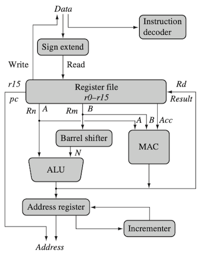
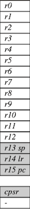
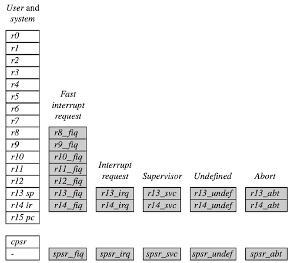
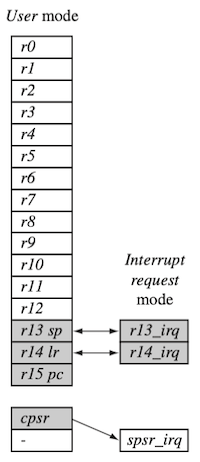
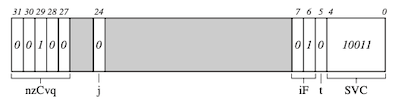

# 2 ARM Processor Fundamentals

다음은 ARM core의 dataflow를 나타낸 도식이다. load-store architecture의 특성상, 데이터 연산은 레지스터 내부에서만 수행된다.

> register: `Rd`(destination), `Rm`(operand1), `Rn`(operand2)

> sign extend: 8bit, 16bit 정수를 32bit로 부호 확장

- 레지스터 파일(register file)은 32-bit 레지스터로 구성된다.

- 데이터 처리 명령은 결과를 Rd에, load/store 명령은 결과를 address register에 저장한다.

---

## 2.1 Registers

다음은 user mode에서 가용한 범용 레지스터(general purpose registers)를 표현한 그림이다.

> notation: 'r' + 'register_number'

- 16개 data register, 2개 process status register로 구성

- `r13`, `r14`, `r15`

  | 레지스터 | 용도 |
  | --- | --- |
  | `r13` | stack pointer(sp) |
  | `r14` | link register(lr) |
  | `r15` | program counter(pc) |

> link register: 함수(서브루틴) 호출 후 돌아올 리턴 주소 저장

> Intel은 주로 리턴 주소를 스택에 저장하는데, ARM에서는 레지스터에 저장하여 더 빠른 수행이 가능하다.

---

## 2.2 Current Program Status Register

다음은 내부 동작을 관찰 및 제어하기 위한 **current program status register**(cpsr, 프로그램 상태 레지스터)를 나타낸 도식이다. (32-bit register)

- 4가지 필드로 구성된다.

  **Flags**, **Status**, **Extension**, **Control**

> 일부 ARM 코어는 추가적인 bit를 갖는다. (e.g., J(Jazelle) flag bit)

---

### 2.2.1 Processor Modes

이때, **processor mode**에 따라서, 레지스터 파일에 대한 접근 권한이 결정된다.

| 종류 | 설명 | 특이사항 |
| --- | --- | --- |
| **privilege**(특권) | - cpsr 전체 읽기/쓰기 가능 | 6가지 종류 존재(abort, fast interrupt request, interrupt request, supervisor, system, undefined) |
| **non-privilege**(비특권) | - cpsr Control 필드 읽기 가능 - Condition flags 읽기/쓰기 가능 | 1가지 존재(user) |

다음은 프로세서 모드에 대응되는 약자와, Mode 필드 값을 정리한 표이다.

| 모드 | 설명 | 약자 | privilged | Mode[4:0] |
| --- | --- | :---: | :---: | :---: |
| Abort | 메모리 접근 실패 | abt | O | 10111 |
| Fast interrupt request | 인터럽트 수준에 따라 진입 | fiq | O | 10001 |
| Interrupt request | 인터럽트 수준에 따라 진입 | irq | O | 10010 |
| Supervisor | 리셋 시 진입, OS 커널 동작 모드 | svc | O | 10011 |
| System | cpsr 완전 쓰기 가능한 특별한 user 모드 | sys | O | 11111 |
| Undefined | 정의되지 않은 명령어 | und | O | 11011 |
| User | 사용자 모드 | usr | X | 10000 |

---

### 2.2.2 Banked Registers

레지스터 파일은 37개 레지스터를 가지며, 여기서 특정 모드에서만 접근이 가능한 20개 레지스터를 **banked register**라고 지칭한다.

- (system 모드를 제외한) 모든 프로세서 모드의 레지스터 수 = 16개 범용 레지스터 + banked 레지스터

> abort 모드: `r13_abt`, `r14_abt`, `spsr_abt`

banked 레지스터는 user 모드 레지스터와 일대일 대응되며, **모드 변경 시 해당 레지스터가 기존 레지스터를 대체**한다.

예를 들어, interrupt request 모드에서는 `r13`, `r14` 레지스터에 접근하면, banked register인 `r13_irq`, `r14_irq`에 접근한다.

- 사용자 모드의 `r13_usr`, `r14_usr`는 영향을 받지 않는다.

- `r0` ~ `r12`: 정상적으로 접근 가능

> fast interrupt request: 주로 자주 불리는 인터럽트에 해당된다. 범용 레지스터를 더 할당하여 메모리 접근을 최소화한다.

---

### 2.2.3 Mode Change

모드 변환은 cpsr 대상으로 한 write, 혹은 하드웨어(exception, interrupt)에 의해 발생한다. 다음은 user 모드에서 interrupt request 모드 변환 시 레지스터를 나타낸 도식이다.

- `r13`, `r14`: `r13_irq`, `r14_irq`로 대체

  > 각각 interrupt request 모드의 `sp`, `lr`를 담는다.

- `spsr_irq`: user 모드의 cpsr를 백업

  > interrupt request 모드에 진입하기 전 cpsr을 저장한다.

---

### 2.2.4 State and Instruction Sets

ARM 코어는 ARM(32 bit), Thumb(16 bit), Jazelle(8 bit) 3가지 상태 및 명령어 집합을 지원한다.

> JAVA `.class` 파일은, 명령어를 1byte 단위로 저장한다.

| | ARM | Thumb | Jazelle |
| --- | :---: | :---: | :---: |
| Instruction size | 32 bits | 16 bits | 8 bits (bytecode) |
| Control | cpsr T = 0, J = 0 | cpsr T = 1 | cpsr T = 0, J = 1 | 

임베디드 시스템에서, JAVA를 사용할 수 있는 이유에 해당되며, JVM(Java Virtual Machine)은 여전히 필요하지만 빠르게 수행이 가능하다.

> Jazelle: 60% 정도의 Java bytecode만 HW에서 지원하므로 주의해야 한다.(나머지는 SW 수준에서 구현 필요)

---

### 2.2.5 Interrupt Masks

인터럽트 마스크는, I(interrupt request, IRQ), F(fast interrupt request, FIQ) bit가 1이면, 해당 인터럽트의 발생을 중단시킨다.

----

### 2.2.6 Condition Flag

다음은 조건 플래그가 표현할 수 있는 상태를 기록한 도표이다.

| 플래그 | 이름 | 설정 조건 |
| --- | --- | --- |
| N | Negative | 결과가 음수일 때 |
| Z | Zero | 결과가 0일 때 |
| C | Carry | unsigned overflow 발생 시 |
| V | oVerflow | signed overflow 발생 시 |
| Q | Saturation | overflow 혹은 saturation 발생 시 |

다음은 cpsr 플래그 예시이다.

> 회색: reserved 영역

- C(Carry) bit 세트, ARM 상태, IRQ 비활성화, supervisor(SVC) 모드

---

### 2.2.7 Conditional Execution

**conditional execution**(조건부 실행)은, 명령의 condition attribute와 cpsr의 조건 플래그를 비교하고, 일치할 경우 명령을 수행한다.

> on: 대문자, off: 소문자

> `adds`처럼 명령어 뒤에 `s`(suffix)를 붙이면 flag를 업데이트한다.

| Mnemonic | Name | Condition flag |
| --- | --- | --- |
| EQ | equal | Z |
| NE | not equal | z |
| CS HS | carry set/unsigned higher or same | C |
| CC LO | carry clear/unsigned lower | C |
| MI | minus/negative | N |
| PL | plus/positive or zero | n |
| VS | overflow | V |
| VC | no overflow | v |
| HI | unsigned higher | zC |
| LS | unsigned lower or same | Z or c |
| GE | signed greater or equal | NV or nv |
| LT | signed less than | Nv or nV |
| GT | signed greater than | NzV or nzv |
| LE | signed less than or equal | Z or Nv or nV |
| AL | always(unconditional) | ignored |

> 참고로, sticky한 특성을 갖는다.(한번 켜지면, 별도로 끄지 않는 이상 flag를 유지한다.)

---
