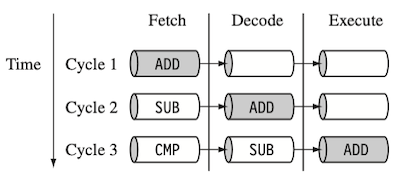
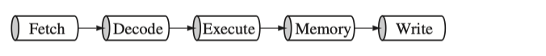
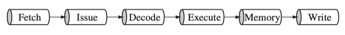
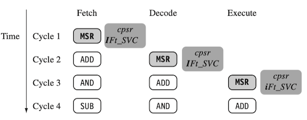
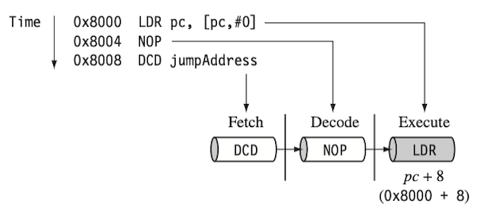
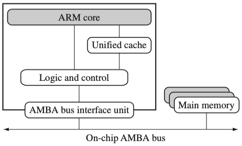
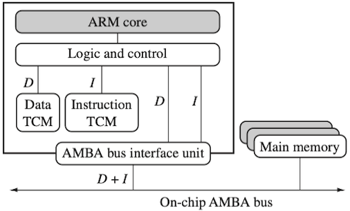
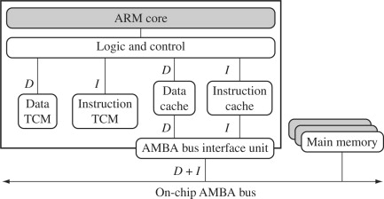

# 2 ARM Processor Fundamentals

---

## 2.3 Pipeline

다음은 명령어를 병렬로 처리하는 **pipelining** 기법을 간략히 3단계로 표현한 그림이다. (1 stage = 1 cycle)

- 파이프라인에서 명령어는 **Execute** 단계에서 처리되므로, stage의 수가 많으면 그만큼 긴 latency를 갖는다.

  (파이프라인에 명령어를 모두 채운 **steady state**가 될 때까지의 지연시간)

> 단, ARM 계열에 따라서도 파이프라인 설계가 다르므로 유의해야 한다.
>
> | | |
> | :---: | --- |
> | ARM9 |  |
> | ARM10 |  |

---

### 2.3.1 Pipeline Executing Characteristics

cycle 1~4 동안 파이프라인 stage를 나타낸 예시를 살펴보자.

- `MSR`(Mode Status Register)
 
  execute stage가 끝날 때 cpsr 레지스터의 `I` bit를 0으로 설정(clear)하는 것으로, IRQ(Interrupt Request)가 활성화된다.

- `pc`(Program Counter)

  Execute stage의 `pc` 값은, 최종적으로 8 bytes 만큼 증가한다.

> 참고로 `pc` 값은 stage마다 자동으로 4 bytes씩 증가한다. (Thumb mode: 2 bytes씩 증가)
> 
> - `LDR`: load to register, `NOP`: no operation, `DC*`: 데이터 할당(e.g., `DCD`: 워드 데이터)
> 
> - `[pc + #0]`: 현재 `pc`가 가리키는 주소를 load.
>
> - Execute 단계에서는 8 bytes 만큼 증가하게 된다. (`0x8000` $\rightarrow$ `0x8008`)
>
> 

---

## 2.4 Exceptions, Interrupts, Vector Table

인터럽트 발생 시, `pc`는 벡터 테이블 내 특정 주소를 가리키도록 설정된다.

- **Vector Table**: 각 entry는, 예외 혹은 인터럽트 처리 루틴으로 분기하는 주소를 가리킨다.

- **Software Interrupt vector**: SWI 명령 실행 시, OS 루틴을 호출하면서 주로 사용 (0x00000008 번지)

> 일부 프로세서는 high address로부터 벡터 테이블을 시작한다.

| Exception/interrupt | Shorthand | Address | High address |
| --- | --- | --- | --- |
| Reset | RESET | 0x00000000 | 0xffff0000 |
| Undefined instruction | UNDEF | 0x00000004 | 0xffff0004 |
| Software interrupt | SWI | 0x00000008 | 0xffff0008 |
| Prefetch abort | PABT | 0x0000000c | 0xffff000c |
| Data abort | DABT | 0x00000010 | 0xffff0010 |
| Reserved | - | 0x00000014 | 0xffff0014 |
| Interrupt request | IRQ | 0x00000018 | 0xffff0018 |
| Fast interrupt request | FIQ | 0x0000001c | 0xffff001c |

---

## 2.5 Core Extensions

ARM core의 옆에 위치하여 성능을 향상시키거나 다양한 기능을 제공한다.

---

### 2.5.1 Cache and Tightly Coupled Memory(TCM)

**cache**는 core와 main memory 사이에 있는 fast memory block으로, 효율적으로 데이터를 저장하고 가져오기 위해 사용된다.

> ARM 기반 임베디드 시스템은 주로 single-level 캐시를 사용한다.

다음은 core와 cache를 연결하는 두 가지 대표적인 구조이다. 이때, 하버드 구조에서는 실시간 알고리즘에서 캐시의 non-deterministic한 지연시간을 개선하기 위해, fast SRAM 메모리인 **Tightly Coupled Memory**(TCM)를 사용한다.

| 폰 노이만 구조 (Von Neumann style) | 하버드 구조 (Harvard style) |
| :---: | :---: |
|  |  |
| memory, instruction: unified cache로 결합 | memory TCM, instruction TCM 별도 구현 |
| ARM 7 | ARM 9, 10, 11 |

> 실시간 시스템에서는 코드 실행 시간이 **deterministic**해야 하며, 명령이나 데이터를 load/store하는 시간을 예측할 수 있어야 한다. 

> 참고로 두 구조를 결합하여 각각의 장점을 취한 **hybrid architecture**도 존재한다.
>
> 

---

### 2.5.2 Memory Management Hardware

임베디드 시스템은 메모리 장치를 여러 개 가지는 경우가 많으므로, 부적절한 메모리 접근을 막는 장치가 필요하다. 다음은 ARM에서 메모리 보호를 위해 사용되는 세 가지 유형의 하드웨어를 나타낸다.

| **Type** | **Protection** | **Features** |
| --- | --- | --- |
| Non-protected memory | 보호를 제공하지 않음 | fixed, very little flexibility <U>작고 단순한 임베디드 시스템</U>에서 사용 |
| **MPU**(Memory Protection Unit) | simple한 보호 제공 | **coprocessor register set**으로 제어 비교적 <U>단순한 memory map을 갖는 시스템</U>에서 사용 |
| **MMU**(Memory Management Unit) | comprehensive한 보호 제공 | **virtual address**를 활용한다. <U>멀티테스킹을 지원하는 정교한 플랫폼</U>에서 사용 |

---

### 2.5.3 Coprocessor

ARM 프로세서와 연결되어, 명령어 집합의 확장 기능 혹은 configuration register set 역할을 수행한다. (전용 ARM 명령어를 사용)

- e.g., coprocessor 15(`CP15`): cache, TCM를 제어하고 memory management를 수행한다.

  <blockquote>

  4, 11-12: UNUSED 

  | CP15 Register | Read | Write |
  | --- | --- | --- |
  | 0 | ID code | Unpredictable |
  | 0 | Cache type | Unpredictable |
  | 1 | Control | Control |
  | 2 | Translation table base | Translation table base |
  | 3 | Domain access control | Domain access control |
  | 4 | Unpredictable | Unpredictable |
  | 5 | Fault status | Fault status |
  | 6 | Fault address | Fault address |
  | 7 | Unpredictable | Cache operations |
  | 8 | Unpredictable | TLB operations |
  | 9 | Cache lockdown | Cache lockdown |
  | 10 | TLB lockdown | TLB lockdown |
  | 11 | Unpredictable | Unpredictable |
  | 12 | Unpredictable | Unpredictable |
  | 13 | FCSE PID | FCSE PID |
  | 14 | Unpredictable | Unpredictable |
  | 15 | Test configuration | Test configuration |

  </blockquote>

- 명령어에서 `register 0`은 `opcode_2` field에 따라 읽는 레지스터가 달라진다.
  
  - `MRC p15,0,Rd,c0,c0,0`: ID code register를 읽는다.
  
  - `MRC p15,0,Rd,c0,c0,1`: Cache type register를 읽는다.

---