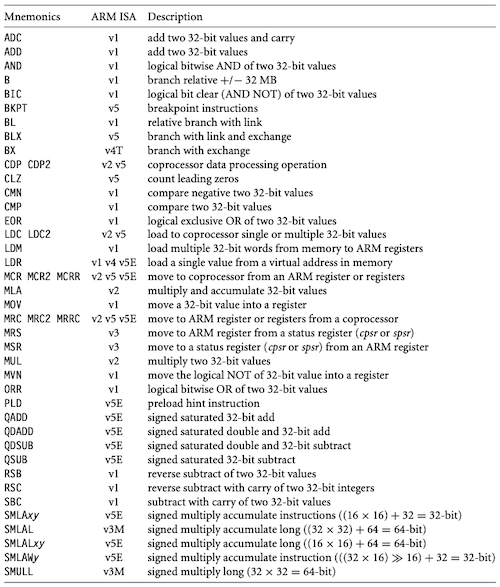
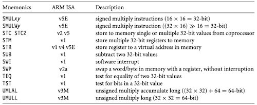
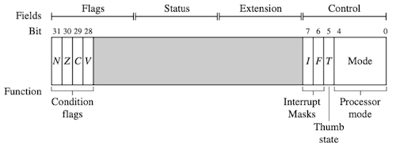
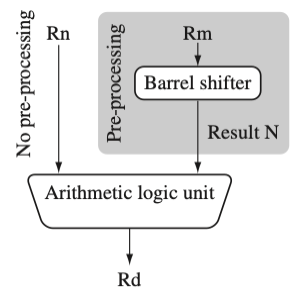
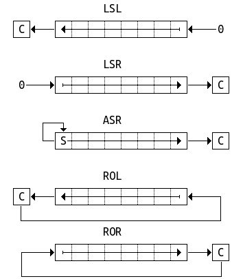

# 3 Introduction to ARM Instruction Set

이번 절에서는 명령어 및 메모리를 다음과 같이 표기한다.

| 명령어 전/후 | 명령어 | 메모리 |
| --- | --- | --- | 
| **PRE** $\;$ `<pre-conditions>`<br/> $\quad \quad$ `<instructions/s>`<br/>**POST** `<post-conditions>` | `instructions{<cond>}{S} Rd, Rn, N` 등 |  `mem<data_size>[address]` |

> e.g.,
> > - `mem32[1024]`: 1KB 번지부터 시작하는 32-bit 데이터
> >
> > - `ADD r3, r1, r2`: `Rd`(`r3`) = `Rn`(`r1`) + `Rm`(`r2`)

> `N`: immediate(\#를 앞에 붙여서 표기)
>
> > 주의: `N`은 배럴 시프터에 의해 전처리된 `Rm`일 수 있다.

다음은 ARM instruction set을 나열한 도표이다.





> ARM ISA: 해당 명령어가 처음 도입된 리비전. 새 명령어를 추가되어도 backward compatible하다.

---

## 3.1 Data Processing Instructions

데이터 처리 명령어에 `s` suffix 접미어를 붙여서, cpsr 플래그를 갱신할 수 있다. 

> move, logical instruction에 붙이면, `N`, `Z`, `C` flag를 갱신한다.



| flags | meaning | set |
| --- | --- | --- |
| `N` | **Negative** | 최상위 비트 == 1 |
| `Z` | **Zero** | 결과 == 0 |
| `C` | **Carry** | 배럴 시프트 연산 결과에서, 마지막 비트 shift 발생 |

---

### 3.1.1 Move Instructions

**move instruction**은 `N`(소스 레지스터 `Rm` 혹은 immediate `#`)을, 목적 레지스터 `Rd`로 복사한다.

> Syntax: `<instruction>{<cond>}{S} Rd, N`

| | | |
| :---: | --- | --- |
| `MOV` | (32-bit) 값을 복사 | `Rd=N` |
| `MVN` | (32-bit) NOT을 취한 값을 복사 | `Rd=~N` |

다음 코드는 `MOV` 명령어를 통해, `r5` 레지스터 값을 `r7` 레지스터에 복사하는 예시다.

```assembly
PRE    r5 = 5
       r7 = 8

       MOV   r7, r5     ; let r7 = r5

POST   r5 = 5
       r7 = 5
```

---

### 3.1.2 Barrel Shifter

ALU에서 연산을 수행하기 전, 필요에 따라 **barrel shifter**에서 `Rm` 레지스터 값 대상으로 전처리를 수행한다.(전처리 결과: `N`) 

> 이때, 배럴 시프터는 cycle을 추가로 요구하지 않는다.



다음은 배럴 시프터를 사용하는 데이터 처리 명령어를 정리한 도표이다. (**x**: register, **y**: shift amount)


<table>
<tr>
<td>

> Syntax e.g.,
>
> > - `Rm, LSL #shift_imm`: Logical shift left by immediate
> >
> > - `Rm, LSL Rs`: Logical shift left by register

| Mnemonic | Description | Result | shift amount y |
| :---: | --- | --- | --- |
| `LSL` | logical shift left | x << y | `#0-31` or `Rs` |
| `LSR` | logical shift right | (unsigned) x >> y | `#1-32` or `Rs` |
| `ASR` | arithmetic shift right | (signed) x >> y | `#1-32` or `Rs` |
| `ROR` | rotate right | ((unsigned) x >> y) \| (x << (32 - y))  | `#1-31` or `Rs` |
| `RRX` | rotate right extend<br/>(carry bit 포함) | (C flag << 31) \| ((unsigned) x >> 1) | none |

</td>
<td> 



</td>
</tr>
</table>

> arithmetic shift는 부호 비트를 유지(signed)하며, logical shift는 무조건 0으로 채운다.(unsigned)
>
> > 단, shift left 명령은 logic과 arithmetic 모두 동일하다.(`LSL`=`ASL`)

> `MLU`, `CLZ`, `QADD`처럼, 배럴 시프터를 사용하지 않는 데이터 처리 명령도 있다.

다음은 move instruction의 전처리 과정에서, logical shift left 명령을 수행한 예시다.

```assembly
PRE    r5 = 5
       r7 = 8

       MOV   r7, r5, LSL #2     ; let r7 = r5*4 = (r5 << 2)

POST   r5 = 5
       r7 = 5
```

---

#### 3.1.2.1 Example of Logical Shift Left and Flag Update

데이터 처리 명령어에 `s` suffix를 붙인 예시를 살펴보자. 다음 예시는 `MOVS` 명령어에 의한 cpsr 조건 플래그 변화를 나타낸다.

- `N`: `r1`(0x80000004) 값에 `LSL #1` 연산을 수행한 결과


<table>
<tr>
<td>  </td> <td> </td>
</tr>
<tr>
<td> 

assembly

</td>
<td> 

```assembly
PRE   cpsr = nzcvqiFt_USER
      r0 = 0x00000000
      r1 = 0x80000004

      MOVS    r0, r1, LSL #1

POST  cpsr = nzCvqiFt_USER
      r0 = 0x00000008
      r1 = 0x80000004
```

</td>
</tr>
<tr>
<td> 

update

</td>
<td> 

> `0x80000004`=`1000 0000 0000 0000 0000 0000 0000 0100`
> $$\downarrow$$
> - Carry Flag `c` $\rightarrow$ `C` 업데이트
>
> `0x00000008`=`0000 0000 0000 0000 0000 0000 0000 1000`

</td>
</tr>
<tr>
<td> 

cpsr

</td>
<td> 


</td>
</tr>
</table>


---

### 3.1.3 Arithmetic Instructions

**arithmetic instruction**은 두 32-bit 값 대상으로 덧셈 혹은 뺄셈을 수행한다.

> Syntax: `<instruction>{<cond>}{S} Rd, Rn, N`

| | | |
| :---: | --- | --- |
| `ADC` | 두 값 및 carry 덧셈 | `Rd=Rn+N+carry` |
| `ADD` | 두 값 덧셈 | `Rd=Rn+N` |
| `RSB` | 두 값의 reverse 뺄셈 | `Rd=N-Rn` |
| `RSC` | 두 값 및 carry의 reverse 뺄셈 | `Rd=N-Rn-!(carry flag)` |
| `SBC` | 두 값 및 carry를 포함한 뺄셈 | `Rd=Rn-N-!(carry flag)` |
| `SUB` | 두 값 뺄셈 | `Rd=Rn-N` |

다음은 세 가지 산술 명령어(`SUB`, `RSB`, `SUBS`)를 수행한 예시이다.

```assembly
// SUB
PRE    r0 = 0x00000000
       r1 = 0x00000002
       r2 = 0x00000001
      
       SUB r0, r1, r2

POST   r0 = 0x00000001


// RSB
PRE    r0 = 0x00000000
       r1 = 0x00000077

       RSB r0, r1, #0         ; Rd = 0x0 - r1

POST   r0 = -r1 = 0xffffff89


// SUBS
PRE    cpsr = nzcvqiFt_USER
       r1 = 0x00000001

       SUBS r1, r1, #1

POST   cpsr = nzCvqiFt_USER
       r1 = 0x00000000
```

---

### 3.1.4 Logical Instructions

**logical instruction**은 두 레지스터 대상으로 bitwise 논리 연산을 수행한다.

> Syntax: `<instruction>{<cond>}{S} Rd, Rn, N`

| | | |
| :---: | --- | --- |
| `AND` | logical bitwise AND | `Rd=Rn&N` |
| `ORR` | logical bitwise OR | `Rd=Rn\|N` |
| `EOR` | logical exclusive OR | `Rd=Rn^N` |
| `BIC` | logical bit clear(AND NOT) | `Rd=Rn&~N` |

다음은 두 가지 논리 명령어(`ORR`, `BIC`)를 수행한 예시다.

```assembly
// ORR
PRE    r0 = 0x00000000
       r1 = 0x02040608
       r2 = 0x10305070
      
       ORR r0, r1, r2

POST   r0 = 0x12345678

// BIC
PRE    r1 = 0b1111
       r2 = 0b0101

       BIC r0, r1, r2

POST   r0 = 0b1010
```

---

### 3.1.5 Comparison Instructions

**comparision instruction**은 레지스터와 32 bit 값을 비교하여 cpsr 플래그 비트를 갱신한다. (주로 conditional execution을 위해 사용)

- **결과를 저장하지 않으며, 레지스터 값은 변하지 않는다.**

> Syntax: `<instruction>{<cond>}{S} Rn, N`

| | | |
| :---: | --- | --- |
| `CMN` | compare negated(a+b) | `Rn+N` 결과로 flag set |
| `CMP` | compare(a-b) | `Rn-N` 결과로 flag set  |
| `TEQ` | test for equality(exclusive OR) | `Rn^N` 결과로 flag set |
| `TST` | test bits(AND) | `Rn&N` 결과로 flag set |

> e.g.,
>
>> - `TST r1 #FFFFFFFF`: 비트가 하나라도 켜져 있으면 flag set 
>>
>>    (0xFFFFFFFF = 1111 1111 1111 1111 1111 1111 1111 1111)

> `CMN` 명령어는 2의 보수를 비교할 때 유용한데, `(a-(-b)) = a+b` 처럼 동작하기 때문이다.

다음 예시는 `r0`과 `r9` 레지스터 대상으로 `CMP` 연산을 수행했을 때의 `Z` flag 변화를 나타낸다.

```assembly
PRE    cpsr = nzcvqiFt_USER
       r0 = 4
       r9 = 4
      
       CMP r0, r9

POST   cpsr = nZcvqiFt_USER
```

----

### 3.1.6 Multiply Instructions

**multiply instruction**은 두 레지스터 값을 곱하는 연산이다. 명령어에 따라서는  결과 값을 다른 레지스터에 누적한다.

> 곱셈 명령 수행에 드는 \#cycle은 프로세서마다 다르다.

> Syntax
>
> - `MLA{<cond>}{S} Rd, Rm, Rs, Rn`
>
> - `MUL{<cond>}{S} Rd, Rm, Rs`

| | | |
| :---: | --- | --- |
| `MLA` | multiply and accumulate | `Rd=(Rm*Rs)+Rn` |
| `MUL` | multiply | `Rd=Rm*Rs` |

다음은 `r1`과 `r2` 레지스터 내 값을 곱하는 `MUL` 명령어 수행 예시다.

```assembly
PRE    r0 = 0x00000000
       r1 = 0x00000002
       r2 = 0x00000002
      
       MUL r0, r1, r2    ; r0 = r1 * r2

POST   r0 = 0x00000004
       r1 = 0x00000002
       r2 = 0x00000002
```

---

#### 3.1.6.1 Long Multiply Instructions

또한, ARM에서는 **long multiply** 연산(64-bit) 명령도 지원한다. 

- 레지스터 한 쌍을 사용해서 64-bit를 표현한다.

> Syntax: `<instruction>{<cond>}{S} RdLo, RdHi, Rm, Rs`

| | | |
| :---: | --- | --- |
| `SMLAL` | signed multiply accumulate long | `[RdHi,RdLo]=[RdHi,RdLo]+(Rm*Rs)` |
| `SMULL` | signed multiply long | `[RdHi,RdLo]=Rm*Rs` |
| `UMLAL` | unsigned multiply accumulate long | `[RdHi,RdLo]=[RdHi,RdLo]+(Rm*Rs)` |
| `UMULL` | unsigned multiply long | `[RdHi,RdLo]=Rm*Rs` |

다음은 두 `r2`, `r3` 레지스터의 unsigned long 값을 곱하는 `UMULL` 명령어 수행 예시다.

```assembly
PRE    r0 = 0x00000000
       r1 = 0x00000000
       r2 = 0xf0000002
       r3 = 0x00000002

       UMULL r0, r1, r2, r3   ; [r1, r0] = r2*r3

POST   r0 = 0xe0000004        ; = RdLo
       r1 = 0x00000001        ; = RdHi
```

---
