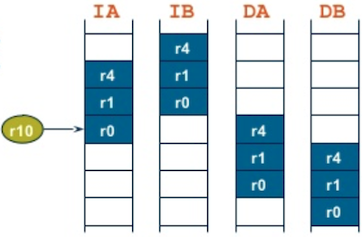
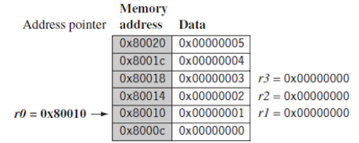
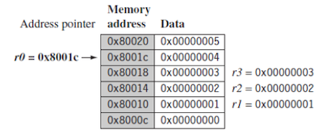
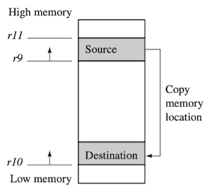
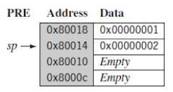
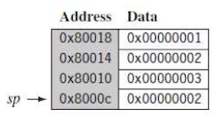

# 3 Introduction to ARM Instruction Set

--- 

## 3.2 Branch Instructions

**branch instruction**은 실행 흐름의 변경 혹은 루틴을 호출하면서 사용한다. 

> 고급 언어의 서브루틴, if-then-else, loop에서 사용한다.

branch instruction 사용 시, 다음 사항을 주의해야 한다.

- `label`: pc-relative address 계산을 위한 offset 

  단, offset이 가질 수 있는 bit-width 한계로, $\pm$ 32MB 이내 값을 가져야 한다.

- `pc`: 새로운 주소를 갖게 된다.

  단, 짝수를 갖는 주소 대상으로만 jump할 수 있다.

다음은 ARM 분기 명령어를 정리한 도표이다.

> Syntax
>
> - `B{<cond>} label`
>
> - `BL{<cond>} label`
>
> - `BX{<cond>} Rm`
>
> - `BLX{<cond>} label | Rm`

| | | |
| --- | --- | --- |
| `B` | unconditional | `pc=label` |
| `BL` | branch and link(return address) | `pc=label`<br/>`lr=BL 이후 instruction 주소` |
| `BX` | branch exchange | `pc=Rm&0xfffffffe`, `T=Rm&1` |
| `BLX` | branch exchange with link | `pc=label`, `T=1`<br/>`pc=Rm&0xfffffffe`, `T=Rm&1`<br/>`lr=BLX 이후 instruction 주소` |

> `&1`: 마지막에 1비트를 추가해야 thumb 모드에 진입할 수 있다.

> (활용) `B`: goto, `BL`: 일반적인 함수 호출, `BX`: thumb 모드 진입(16비트), `BLX`: thumb 모드에서 함수 호출

다음 코드는 두 방식(forward, backward)의 분기 명령어 예시다. 

```assembly
       B     forward  
       ADD   r1, r2, #4
       ADD   r0, r6, #2
       ADD   r3, r7, #4
forward                   ; 중간에 위치한 3 instruction을 skip
       SUB   r1, r2, #4
-----------------------
backward                  ; infinite loop로 작동
       ADD   r1, r2, #4
       SUB   r1, r2, #4
       ADD   r4, r6, r7
       B     backward
```

---

## 3.3 Load-Store Instructions

**load-store instruction**은 메모리와 레지스터 사이에서 데이터를 전송한다.

---

### 3.3.1 Single-Register Transfer

단일 레지스터 전송 명령어는 데이터 타입으로 **word**(32-bit), **halfword**(16-bit), **byte**(8-bit)을 지원한다.

>`B`: byte, `H`: half, `SB`: signed byte, `SH`: signed halfword

> Syntax
>
> - `<LDR|STR>{<cond>} Rd, addressing`
>
> - `LDR{<cond>}SB|H|SH Rd, addressing`
>
> - `STR{<cond>}B|H Rd, addressing`

| | | |
| --- | --- | --- |
| `LDR` | load word into register | `Rd<-mem32[address]` |
| `STR` | store word from register | `Rd->mem32[address]` |
| `LDRB` | load byte into register | `Rd<-mem8[address]` |
| `STRB` | store byte from register | `Rd->mem8[address]` |
| `LDRH` | load halfword into register | `Rd<-mem16[address]` |
| `STRH` | store halfword from register | `Rd->mem16[address]` |
| `LDRSB` | load signed byte into register | `Rd<-SignExtend(mem8[address])` |
| `LDRSH` | load signed halfword into register | `Rd<-SignExtend(mem16[address])` |

다음은 레지스터 `r1`이 포함하고 있는 주소(대상을 **base register**로 지칭)를 읽은 뒤, 메모리 주소 내 값을 `r0`에 불러오는 코드이다. (offset = 0)

```assembly
       LDR    r0, [r1]     ; = LDR r0, [r1, #0]
```

---

### 3.3.1.1 Single-Register Load-Store Addressing Mode

ARM 명령어는 다양한 indexing과 addressing mode를 지원한다. 

- **preindex with wb**, **postindex**: 데이터 구조 내 element에 접근할 때 유용

- **preindex**: base address를 업데이트하지 않으므로, 배열 탐색에 유용

| Index method | Data | Base address register | 
| --- | --- | --- | 
| **Preindex with writeback** | `mem[base+offset]` | base + offset | 
| **Preindex** | `mem[base+offset]` | not updated | 
| **Postindex** | `mem[base]` | base + offset | 

> `!`: writeback

다음 코드는 indexing 방법에 따라, `LDR` 명령어 수행 시 변화를 나타낸 예시다.

<table>
<tr>
<td> </td> <td>  </td> 
</tr>
<tr>
<td>

PRE

</td>
<td> 

```assembly
PRE     r0 = 0x00000000
        r1 = 0x00090000
        mem32[0x00009000] = 0x01010101
        mem32[0x00009004] = 0x02020202
```

</td>
</tr>
<tr>
<td> 

POST<br/>(1) **Preindex with wb**

</td>
<td> 

```assembly
        LDR r0, [r1, #4]!

POST    r0 = 0x02020202 ; r1번지+4 값  
        r1 = 0x00009004 ; base address update 
```

</td>
</tr>
<tr>
<td> 

POST<br/>(2) **Preindex**

</td>
<td> 

```assembly
        LDR r0, [r1, #4]

POST    r0 = 0x02020202 ; r1번지+4 값
        r1 = 0x00009000
```

</td>
</tr>
<tr>
<td> 

POST<br/>(3) **Postindex**

</td>
<td> 

```assembly
        LDR r0, [r1], #4

POST    r0 = 0x01010101 ; r1번지 값
        r1 = 0x00009004 ; base address update
```

</td>
</tr>
</table>

---

### 3.3.2 Multiple-Register Transfer

단일 명령으로, 메모리와 복수 레지스터 사이에 데이터를 전송할 수 있다.

- \#cycles: 메모리 순차접근( $t$ cycles) vs $N$ 개 레지스터 다중 전송( $2+N * t$ cycles)

  단, interrupt를 중단하므로 **인터럽트 지연**이 늘어날 수 있다.

> Syntax: `<LDM|STM>{<cond>}{addressing mode} Rn{!},<register list>{^}`

| | | |
| :---: | --- | --- |
| `LDM` | load multiple register | `{Rd}` ${}^{*N}$ `<-mem32[start address+4*N]` <br/>(optional `Rn` updated) |
| `STM` | store multiple register | `{Rd}` ${}^{*N}$ `->mem32[start address+4*N]` <br/>(optional `Rn` updated) |

---

#### 3.3.2.1 Addressing Mode for Load-Store Multiple

이때, 다중 레지스터 전송 명령은 다양한 addressing mode에 따라 분류된다. 다음은 네 가지 addressing mode를 설명한 도표이다.

| mode | Description | Start address | End address | Rn\! |
| --- | --- | --- | --- | --- |
| IA | increment after | `Rn` | `Rn+4*N-4` | `Rn+4*N` |
| IB | increment before | `Rn+4` | `Rn+4*N` | `Rn+4*N` |  
| DA | decrement after | `Rn-4*N+4` | `Rn` | `Rn-4*N` |
| DB | decrement before | `Rn-4*N` | `Rn-4` | `Rn-4*N` |

다음은 addressing mode별 `<LDMxx|STMxx>  r10,  {r0, r1, r4}` 명령 수행 후, 메모리 상태를 나타낸 그림이다.(`r10`: base register)



---

#### 3.3.2.2 Multiple-Register Transfer Example

다음 코드는 `LDMIA r0!, {r1-r3}` 명령 및 메모리 변화를 나타낸 예시다.

> `{}` 내부에서 `-`나 `,`를 이용해서 레지스터를 나열할 수 있다.

> write back에 따라, 0x80010에서 0x8001c로 증가

<table>
<tr>
<td> PRE </td> <td> POST </td> 
</tr>
<tr>
<td>



</td>
<td> 



</td>
</tr>
<tr>
<td>

```assembly
PRE
        mem32[0x80018] = 0x03
        mem32[0x80014] = 0x02
        mem32[0x80010] = 0x01
        r0 = 0x00080010
        r1 = 0x00000000
        r2 = 0x00000000
        r3 = 0x00000000
        
        LDMIA r0!, {r1-r3}
```

</td>
<td>

```assembly
POST
        r0 = 0x0008001c ; base address update
        r1 = 0x00000001
        r2 = 0x00000002
        r3 = 0x00000003


```

</td>
</tr>
</table>

다음 코드는 (memcpy 함수 등에서 주로 사용하는) 메모리 블록 복사를 나타낸 예시다.

- `CMP r9, r11`: 두 포인터가 같은 위치를 가리키게 되면, `BNE`를 통해 loop를 빠져나간다.

<table>
<tr>
<td> assembly </td> <td> memory </td> 
</tr>
<tr>
<td>

```assembly
; r11   source data 끝 지점 pointer       (high memory)
; r9    source data 시작 지점 pointer

; r10   destination data 시작 지점 pointer (low memory)

loop
        LDMIA r9!,  {r0-r7}     ; load 32 bytes,  update r9 pointer
        STMIA r10!, {r0-r7}     ; store 32 bytes, update r10 pointer
        CMP   r9, r11
        BNE   loop
```

</td>
<td> 



</td>
</tr>
</table>

---

#### 3.3.2.3 Stack Operations

ARM은 스택 연산에서 다중 레지스터 전송 명령을 사용한다. 

> full: 채워져 있는 마지막 주소를 가리킴(삽입 시 포인터 주소 증가 필요), empty(바로 다음 빈 공간을 가리킴)

| Addressing mode | Description | Pop | = LDM | Push | = STM |
| --- | --- | --- | --- | --- | --- |
| FA | full ascending | `LDMFA` | `LDMDA` | `STMFA` | `STMIB` |
| FD | full descending | `LDMFD` | `LDMIA` | `STMFD` | `STMDB` |
| EA | empty ascending | `LDMEA` | `LDMIB` | `STMEA` | `STMIB` |
| ED | empty descending | `LDMED` | `LDMDA` | `STMED` | `STMDA` |

다음 코드는 full descending 방식의 `STMFD  sp!, {r1-r4}` 명령을 수행한 예시이다.

<table>
<tr>
<td> PRE </td> <td> POST </td> 
</tr>
<tr>
<td>



</td>
<td> 



</td>
</tr>
<tr>
<td>

```assembly
PRE
        r1 = 0x00000002
        r4 = 0x00000003
        sp = 0x00080014

        STMFD  sp!, {r1-r4}
```

</td>
<td>

```assembly
POST
        r1 = 0x00000002
        r4 = 0x00000003
        sp = 0x0008000c


```

</td>
</tr>
</table>

---

### 3.3.3 Swap Instructions

**swap instruction**은 메모리와 레지스터 값을 교환한다.

- atomic(all or nothing 실행)한 특성을 가지며, 따라서 semaphore와 mutual exclusion 구현에 유용하다.

>intel의 경우, `tst`(test and set)에 해당된다.

> Syntax: `SWP{B}{<cond>} Rd,Rm,[Rn]`

| | | |
| --- | --- | --- |
| `SWP` | swap word| `tmp=mem32[Rn]`<br/>`mem32[Rn]=Rm`<br/>`Rd=tmp` |
| `SWPB` | swap byte | `tmp=mem8[Rn]`<br/>`mem8[Rn]=Rm`<br/>`Rd=tmp` |

다음 코드는 `SWP r0, r1, [r2]` 명령어를 수행한 예시다.

> (1) `r2` 메모리 주소 데이터를 `r0` 레지스터에 저장, (2) `r1` 레지스터 값은 `r2` 메모리 주소 데이터로 저장

```assembly
PRE     mem32[0x9000] = 0x12345678
        r0 = 0x00000000
        r1 = 0x11112222
        r2 = 0x00009000

        SWP    r0, r1, [r2]

POST    mem32[0x9000] = 0x11112222  ; 레지스터 r1 값 저장
        r0 = 0x12345678             ; r2 메모리 주소 데이터 저장 
        r1 = 0x11112222              
        r2 = 0x00009000
```

다음 코드는 `SWP` 명령을 이용해, busy waiting 방식으로 binary semaphore를 구현한 예시다.

```assembly
spin
        MOV     r1, =semaphore     ; r1 = semaphore 주소
        MOV     r2, #0             ; r2 = 0
        SWP     r3, r2, [r1]       ; 이전 semaphore 값을 r3에 저장
                                   ; semaphore 값을 0으로 초기화
        CMP     r3, #1             ; r3(기존 세마포어 값이 1인지 비교)
        BNE     spin               ; 기존 세마포어 값이 1이 아니면(0이면) 루프 반복   (busy waiting)
```

---