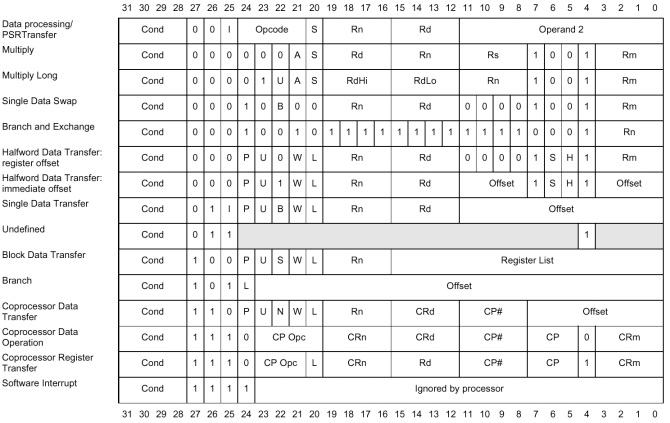
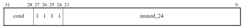
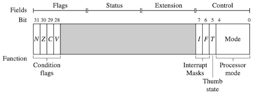

# 3 Introduction to ARM Instruction Set

다음은 여러 32-bit ARM instruction format을 정리한 그림이다.



--- 

## 3.4 Software Interrupt(SWI) Instruction

> [arm Developer: SWI handlers in C and assembly language](https://developer.arm.com/documentation/dui0056/d/handling-processor-exceptions/swi-handlers/swi-handlers-in-c-and-assembly-language)

**SWI**란 application에서 OS 루틴을 호출할 수 있도록 software interrupt exception을 발생시키는 명령어이다.

- 다른 exception과 달리, 사용자에 의한 **synchronous interrupt**이다.

- `pc`: `vector_table + (offset) 0x8`로 설정한다. 

   해당 주소에서, 이후 SWI handler로 분기하게 된다. (9장 참조)

`SWI` 명령어 문법은 다음과 같다.

> Syntax: `SWI{<cond>}{S} SWI_number`
>
> -  `SWI_number`: `<SWI instruction>`의 하위 24-bit를 재활용하여 결정한다.

| | | `pc`, `lr` | `cpsr`, `spsr` |
| --- | --- | --- | --- |
| `SWI` | software interrupt | `pc=vectors+0x8`<br/>`lr_svc`=`SWI` 명령어 이후 명령어 주소 | `spsr_svc=cpsr`<br/>cpsr mode=`SVC`<br/>`I=1` |

다음은 `SWI_number=0x123456`를 인자로 하는 `SWI` 명령어 코드다. 

- `r0`: SWI_Function 루틴에서 사용할 인자

- `0x123456`: `SWI_Number`

```assembly
PRE    cpsr = nzcVqiFt_USER
       pc = 0x00008000            ; pc=현재 SWI 명령어 주소
       lr = 0x003fffff            ; 기존 lr 레지스터 값(r14)
       r0 = 0x12

       0x00008000  SWI  0x123456

POST   cpsr = nzcVqIft_SVC        ; USER mode -> SVC mode
       spsr = nzcVqift_USER
       pc = 0x00000008            ; pc=vectors+0x8
       lr = 0x00008004            ; SWI 다음 명령어 주소(SWI 명령어 주소+4)
       r0 = 0x12
```

---

### 3.4.1 Software Interrupt Handler

보다 상세히 살펴보자. 다음은 SWI 명령어 포맷을 설명한 도표다.

| | |
| --- | --- |
| |  |
| 상위 4bit<br/>([31:28]) | 프로세서의 현태 상태를 나타내는 cond field |
| 다음 상위 4bit<br/>([27:24]) | `SWI` 명령어임을 나타내는 비트 패턴 (`1111`=`SWI`) |
| 하위 24bit<br/>([23:0]) | 24-bit immediate이며, `SWI_number`에 해당된다. |

하위 24-bit immediate인 `SWI_Number`는, 상위 8bit를 masking하여 획득할 수 있다.

- `SWI_Number`: `<SWI instruction> AND NOT (0xff000000)`

다음은 SWI handler 코드다. 

- `SWI` 명령어 주소 = 복귀할 주소의 이전 명령어(`lr-4`)

> SWI handler: 내부에서 switch를 사용해 적절한 루틴으로 분기(`BL`)한다. (`SWI_number`에 따라 switch문이 결정된다.)

```assembly
SWI_handler
      ; Store registers r0-r12 and the link register
      STMFD  sp!, {r0-r12, lr}
      
      ; Read the SWI instruction
      LDR    r10, [lr, #-4]

      ; Mask off the SWI number
      BIC    r10, r10, #0xff000000

      ; r10 - contains the SWI number
      BL     service_routine

      ; return from SWI handler
      LDMFD  sp!, {r0-r12, pc}
```

---

## 3.5 Program Status Register Instructions

ARM에서는, **PSR**(program status register)을 직접 제어할 수 있는 두 가지 명령어를 제공한다.

||| Syntax |
| --- | --- | --- |
| `MRS` | `cpsr`/`spsr` 내용 $\rightarrow$ 레지스터 전송 | `MRS{<cond>} Rd,<cpsr\|spsr>` |
| `MSR` | 레지스터 내용 $\rightarrow$ `cpsr`/`spsr`로 전송 | `MSR{<cond>} <cpsr\|spsr>_<fields>,Rm `<br/>` MSR{<cond>} <cpsr\|spsr>_<fields>,#immediate` |

> field는 **C(control)**, **X(extension)**, **S(status)**, **F(flag)** 임의 조합으로 구성되었다.
>
> 

다음은 `MRS` 명령어를 통해 interrupt request(IRQ)를 활성화하는 코드다.

- `BIC r1, r1, #0x80`: `r1`의 bit 7을 clear한다.

```assembly
PRE    cpsr = nzcvqiFt_USER
       MRS    r1, cpsr        ; r1 = 기존 cpsr 내용
       BIC    r1, r1, #0x80   ; (0x80: 16진수로 0b01000000)
       MSR    cpsr_c, r1      ; bit 7(I)을 clear한 r1 값 전송

POST   cpsr = nzcvqiFt_SVC
```

---

### 3.5.1 Coprocessor Instructions

> coprocessor instruction는 coprocessor에 따라 다르므로, 간략한 개요만 설명한다.

**coprocessor**란 main processor를 도와서 다음과 같은 기능을 수행하는 프로세서이다.

- 추가적인 연산 기능 제공 (floating-point arithmetic, graphic, signal processing 등) 

- memory subsystem 제어 (cache 및 memory management)

다음은 대표적인 coprocessor instruction을 정리한 도표다. (반드시 core가 coprocessor를 가질 때만 사용 가능)

> Syntax
>
> - `CDP{<cond>} cp, opcode1, Cd, Cn {, opcode2}`
>
> - `<MRC|MCR>{<cond>} cp, opcode1, Rd, Cn, Cm {, opcode2}`
>
> - `<LDC|STC>{<cond>} cp, Cd, addressing`
>
> | | |
> | --- | --- |
> | `cp` | `p0~p15`까지의 코프로세서 번호 |
> | `opcode` | 코프로세서에서 수행할 연산 |
> | `Cn`, `Cm`, `Cd` | 코프로세서 내 레지스터 | 

| | | | 
| --- | --- | --- |
| `CDP` | data processing | coprocessor에서 특정 명령 수행 |
| `MRC` `MCR` | register transfer | coprocessor 레지스터와 데이터 교환 |
| `LDC` `STC` | memory transfer | coprocessor 메모리 블록 대상 load/store |

다음은 `MRC` 명령어를 통해, `CP15` 레지스터 값을 범용 레지스터로 복사하는 코드다.

```assembly
; CP15 register c0 to register r10
MRC     p15, 0, r10, c0, c0, 0
```

---

## 3.6 Loading Constants

명령어 구조상 가능한 immediate 크기는 한정적이다.

- 명령어 포맷이 다양한 정보를 담기 때문에, 32-bit 공간을 immediate로 모두 채울 수 없다.

- 예를 들어 `MOV r0 ,#0xff00ffff`은 명령어 구조상 불가능하다. 

대안으로 ARM에서는 레지스터에 32 bit immediate를 적재할 수 있는 2가지 pseudo instruction을 제공한다. (ARM 컴파일러가 실제 명령어로 변환)

> Syntax
>
> - `LDR Rd, =constant`
>
> - `ADR Rd, label`   (`label`: pc-relative address)

> 특별히 immediate를 `#`가 아닌 `=`를 사용해 표기한다.

| | | |
| --- | --- | --- |
| `LDR` | load constrant pseudo-instruction | `Rd=32-bit constant` |
| `ADR` | load address pseudo-instruction | `Rd=32-bit relative address(label)` |

다음 코드는 `LDR` 명령으로 `r0` 레지스터에 32-bit immediate(0xff00ffff)를 적재하는 예시다.

> `DCD` directive: 1개 혹은 여러 개 word 정의
> 
> - `DCD       1,5,20`: 3 words 정의
>
> - `DCD       0xff00ffff`: 0xff00ffff 값을 갖는 1 word 정의


<table>
<tr>
<td> LDR 활용(expensive) </td> <td> MVN 활용 </td> 
</tr>
<tr>
<td>

```assembly
       LDR  r0, [pc, #constant_number-8-{PC}]
       .
       .
constant_number
       DCD 0xff00ffff
```

</td>
<td>


```assembly
PRE    none...

       MVN     r0, #0x00ff0000 

POST   r0 = 0xff00ffff
```

</td>
</tr>
</table>

이때 컴파일러는 가능하다면 메모리 적재를 피하는 방향으로 컴파일하지만, 불가능하다면 메모리에서 적재하게 된다. (disassembler를 사용해 확인 가능) 

- 다음은 두 `LDR` 명령어에서, 실제 컴파일 시 대체된 명령어를 나타낸다.

| Pseudoinstruction | Actual instruction |
| --- | --- |
| `LDR r0,=0xff` | `MOV r0,#0xff` |
| `LDR r0,=0x55555555` | `LDR r0,[pc,#offset_21]` |

---

## 3.7 ARMv5E Extensions

다음은 ARMv5E의 확장 명령이다.

| Instruction | Description |
| --- | --- |
| `CLZ{<cond>} Rd,Rm` | counting leading zero |
| `QADD{<cond>} Rd,Rm,Rn` | signed saturated 32-bit add |
| `QDADD{<cond>} Rd,Rm,Rn` | signed saturated double 32-bit add |
| `QDSUB{<cond>} Rd,Rm,Rn` | signed saturated double 32-bit subtract |
| `QSUB{<cond>} Rd,Rm,Rn` | signed saturated 32-bit subtract |
| `SMLAxy{<cond>} Rd,Rm,Rs,Rn` | signed multiply accumulate 32-bit (1) |
| `SMLALxy{<cond>} RdLo,RdHi,Rm,Rs` | signed multiply accumulate 64-bit |
| `SMLAWy{<cond>} Rd,Rm,Rs,Rn` | signed multiply accumulate 32-bit (2) |
| `SMULxy{<cond>} Rd,Rm,Rs` | signed multiply (1) |
| `SMULWy{<cond>} Rd,Rm,Rs` | signed multiply (2) |


---

### 3.7.1 Counting Leading Zeros

ARM에서는 `CLZ` 명령어를 통해, 최상위 비트부터 0이 나오기까지의 비트 수를 셀 수 있다.

```assembly
PRE    r1 = 0b00000000000000000000000000010000

       CLZ r0, r1
POST   r0 = 27
```

---

### 3.7.2 Saturated Arithmetic

확장 명령을 사용하면, overflow 발생 시 최대값을 대신 반환받을 수 있다.

- 일반 산술 명령: `0x7fffffff + 1 = -0x80000000`처럼 문제 발생

> 예를 들어 communication application이라면, 정확하지 않아도 최대값을 반환받는 연산이 도움이 될 수 있다.

| instruction | saturated calculation |
| --- | --- |
| `QADD` | `Rd=Rn+Rm` |
| `QDADD` | `Rd=Rn+(Rm*2)` |
| `QSUB` | `Rd=Rn-Rm` |
| `QDSUB` | `Rd=Rn-(Rm*2)` |

다음은 `QADD` 명령어를 수행하는 예시다.

- (flag) saturate 발생을 의미하는 `Q`가 set된다.

- 최댓값인 0x7fffffff를 반환한다.

```assembly
PRE    cpsr = nzcvqiFt_USER
       r0 = 0x00000000
       r1 = 0x70000000 (positive)
       r2 = 0x7fffffff (positive)

       QADD r0, r1, r2
POST   cpsr = nzcvQiFt_USER
       r0 = 0x7fffffff
```

> 반대로 `ADD`를 사용하면 `0xefffffff`(negative)를 반환받고, overflow flag인 `V`가 set된다.

---

### 3.7.3 ARMv5E Signed Multiply Instructions

ARM 확장에서는 **16-bit** 데이터 대상으로 작동하는 **signed multiply instrution**을 제공한다. (ARMv5E 구현 기준 단일 cycle로 수행된다.)

> **x**, **y**: 레지스터 값(32-bit) 중 사용할 16-bit 위치를 나타낸다. (= Top(`T`), Bottom(`B`))

| instruction | signed multiply<br/>[Accumulate] | signed<br/>result | Q flag<br/>updated | calculation |
| --- | --- | --- | --- | --- |
| `SMLAxy` | (16-bit \* 16-bit) + 32-bit | 32-bit | O | `Rd=(Rm.x*Rs.y)+Rn` |
| `SMLALxy` | (16-bit \* 16-bit) + 64-bit | 64-bit | - | `[RdHi,RdLo]+=Rm.x*Rs.y` |
| `SMLAWy` | ((32-bit \* 16-bit) >> 16) + 32-bit | 32-bit | O | `Rd=((Rm*Rs.y)>>16)+Rn` |
| `SMULxy` | (16-bit \* 16-bit) | 32-bit | - | `Rd=Rm.x*Rs.y` |
| `SMULWy` | ((32-bit \* 16-bit) >> 16) | 32-bit | - | `Rd(Rm*Rs.y)>>16` |

다음은 `SMLATB` 명령어를 통해, `r1` 상위 16-bit와 `r2` 하위 16-bit를 곱한 뒤, `r3`을 합산하는 코드다.

```assembly
PRE    r1 = 0x20000001
       r2 = 0x20000001
       r3 = 0x00000004

       SMLATB r4, r1, r2, r3

POST   r4 = 0x00002004
```

---

## 3.8 Conditional Execution

Conditional Branch는 조건부 실행 명령어를 활용하여 효율적으로 구현할 수 있다.

<table>
<tr>
<td> Branch(infinite loop) </td> <td> Conditional Branch </td> 
</tr>
<tr>
<td>

```assembly
loop:    
       SUB   r1, r1, #1
       b     loop      ; goto loop

```

</td>
<td> 

```assembly
loop:    
       SUB   r1, r1, #1
       CMP   r1, #0
       BNE   loop      ; Z=0 경우만 분기
```

</td>
</tr>
</table>

다음 코드는 Greatest Common Divisor(GCD, 최대공약수)를 구하는 Euclid's algorithm의 두 가지 구현 예시다. 

- **conditional execution**(조건부 실행)을 이용한 구현이, 분기 명령만으로 구현한 코드보다 효율적이다.

<table>
<tr>
<td> C code </td> <td> Branch Instruction </td> <td> Conditional Execution </td>
</tr>
<tr>
<td>

```c
while (a!=b) 
{
  if (a>b) a -= b; 
  else b -= a;
}


```

</td>
<td> 

```assembly
gcd
    CMP r1, r2
    BEQ complete
    BLT lessthan
    SUB r1, r1, r2
    B   gcd

less_than
    SUB r2, r2, r1
    B   gcd

complete
...
```

</td>
<td> 

```assembly
gcd
    CMP r1, r2
    SUBGT r1, r1, r2
    SUBLT r2, r2, r1
    BNE gcd


```

</td>
</tr>
</table>


---
