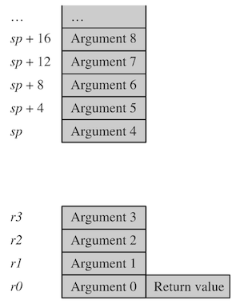

# 5 Efficient C Programming

C 컴파일러는 다음과 같이 레지스터의 할당을 시도한다.

<table>
<tr>
<td> Register<br/>number </td> <td> alternate<br/>register name </td> <td> <br/>ATPCS register usage  </td> 
</tr>
</tr>
<tr>
<td> 

`r0`

</td>
<td> 

`a1`

</td>
<td rowspan="4">

Argument registers

</td>
</tr>
<tr>
<td> 

`r1`

</td>
<td> 

`a2`

</td>
</tr>
<tr>
<td> 

`r2`

</td>
<td> 

`a3`

</td>
</tr>
<tr>
<td> 

`r3`

</td>
<td> 

`a4`

</td>
</tr>
<tr>
<td> 

`r4`

</td>
<td> 

`v1`

</td>
<td rowspan="5">

General variable registers

</td>
</tr>
<tr>
<td> 

`r5`

</td>
<td> 

`v2`

</td>
</tr>
<tr>
<td> 

`r6`

</td>
<td> 

`v3`

</td>
</tr>
<tr>
<td> 

`r7`

</td>
<td> 

`v4`

</td>
</tr>
<tr>
<td> 

`r8`

</td>
<td> 

`v5`

</td>
</tr>
<tr>
<td> 

`r9`

</td>
<td> 

`v6 sb`

</td>
<td> 

General variable registers<br>(static base address)

</td>
</tr>
<tr>
<td> 

`r10`

</td>
<td> 

`v7 sl`

</td>
<td> 

General variable registers<br>(stack limit address)

</td>
</tr>
<tr>
<td> 

`r11`

</td>
<td> 

`v8 fp`

</td>
<td> 

General variable registers<br>(frame pointer)

</td>
</tr>
<tr>
<td> 

`r12`

</td>
<td> 

`ip`

</td>
<td> 

Intra-procedure call scratch register

</td>
</tr>
<tr>
<td> 

`r13`

</td>
<td> 

`sp`

</td>
<td> 

stack pointer

</td>
</tr>
<tr>
<td> 

`r14`

</td>
<td> 

`lr`

</td>
<td> 

link register

</td>
</tr>
<tr>
<td> 

`r15`

</td>
<td> 

`pc`

</td>
<td> 

program counter

</td>
</tr>

</table>

> **frame pointer**: Stackframe의 top 경계를 가리키는 포인터
>
> > gcc의 `-fomit-frame-pointer` 옵션: frame pointer로 사용하지 않도록 설정할 수 있다.(개발이 끝난 상용 단계에서 자주 사용하며, 범용 레지스터를 하나 더 사용할 수 있다.)

---

## 5.4 Register Allocation

C 컴파일러는 함수에서 사용하는 지역 변수를 대상으로 레지스터의 할당을 시도한다. 가용한 레지스터에 비해 할당해야 하는 변수가 많으면, 일부 변수는 스택 메모리에 할당된다. 

컴파일러는 주로 빈번하게 접근(주로 루프문 내부 변수)하는 변수를 레지스터에 할당하고, 나머지를 스택에 할당한다. 이렇게 스택 메모리에 저장되는 변수를, **spilled variable** 혹은 **swapped out variable**이라고 지칭한다.

이론적으로 C 컴파일러는 spillage 없이, 최대 14개 변수를 레지스터에 할당할 수 있다.

- `r0-r12`, `r14` 레지스터 활용 가능 (software stack checking 혹은 frame pointer를 사용하지 않는다고 가정)

- 단, `r4-r11`, `r14` 레지스터는 사용 전에 스택에 먼저 값을 백업해야 한다. (백업 명령은 컴파일러가 자동으로 작성한다.)

그러나 대체로 복잡한 작업을 위해서, 일부 레지스터(e.g., `r12`)는 intermediate scratch register로 사용된다.

> 실질 12개 수준이므로, 함수 내부의 지역 변수 수는 **12개 이하**로 제한하는 것이 효율적이다.

---

## 5.5 Function Calls

ARM Procedure Call Standard(APCS)에서는, 함수의 인자와 리턴 값을 레지스터에 전달하는 방법을 다음과 같이 정의하고 있다.



- 함수의 처음 4개 정수 인자는 `r0-r3`(**argument registers**)에 전달되고, 나머지 인자는 오름차순으로 스택에 할당된다.

- 함수의 정수 리턴 값은 `r0`에 전달된다.

> `long long`, `double` 같은 two-word 데이터 타입은, 한 쌍의 연속된 레지스터를 사용해 전달된다. (리턴 값은 `r0`, `r1`로 나눠서 전달)

> 위 레지스터를 scratch register로 사용하면 함수가 corrupt될 수 있으니 주의해야 한다.

이러한 특성 때문에, 함수는 4개 이하 인자를 가질 때 훨씬 효율적으로 호출할 수 있다. 4개를 넘어서면 **structure**(구조체)를 만들어, 구조체 포인터를 전달하는 편이 효율적이다.

> 단, C++에서는 this가 보이지 않는 첫 번째 인자로 위치하므로, 인자를 3개 이하로 두어야 효율적이다.
>
> > 예를 들어 a1.sum() a2.sum()은 클래스는 같아도 서로 다른 객체이므로 주소가 다르고, this 인자를 통해 해당 객체를 구분한다.

---

### 5.5.1 Optimizing Function Calls

다음은 array `data`에서 $N$ bytes 만큼을 큐에 삽입하는 함수이다. 

- 전달하는 인자가 5개이므로 일부 변수를 스택에 할당해야 한다.

  function call overhead: 4개 레지스터 셋업, 1회 stack push, 1회 stack pull

- 큐는 start address `Q_start`(inclusive), end address `Q_end`(exclusive)를 갖는 cyclic buffer로 구현되어 있다.

- `STR r14,[r13,#-4]!`: link register(`r14`) 값을 스택에 push하고, 스택 포인터(`r13`)를 갱신한다.

<table>
<tr>
<td> C Code </td> <td> Assembly </td>
</tr>
<tr>
<td> 

```c
char *queue_bytes_v1(
  char *Q_start,  /* Queue buffer start address */
  char *Q_end,    /* Queue buffer end address */
  char *Q_ptr,    /* Current queue pointer position */
  char *data,     /* Data to insert into the queue */ 
  unsigned int N) /* Number of bytes to insert */
{
  do
  {
    *(Q_ptr++) = *(data++);
    if (Q_ptr == Q_end)
    {
      Q_ptr = Q_start;
    }
  } while (--N);
  return Q_ptr;
}
```

</td>
<td> 


```assembly
queue_bytes_v1
        STR   r14,[r13,#-4]! ; save lr on the stack
        LDR   r12,[r13,#4]   ; r12 = N
queue_v1_loop
        LDRB  r14,[r3],#1    ; r14 = *(data++)
        STRB  r14,[r2],#1    ; *(Q_ptr++) = r14
        CMP   r2,r1          ; if (Q_ptr == Q_end)
        MOVEQ r2,r0          ;    {Q_ptr = Q_start;}
        SUBS  r12,r12,#1     ; --N and set flags
        BNE   queue_v1_loop  ; if (N!=0) goto loop
        MOV   r0,r2          ; r0 = Q_ptr
        LDR   pc,[r13],#4    ; return r0


```

</td>
</tr>
</table>

함수 인자의 수를 줄이는 최적화 방법으로, 다음과 같이 `Q_start`, `Q_end`, `Q_ptr`을 묶은 구조체 포인터를 대신 전달할 수 있다.

- 명렁어가 하나 더 있지만, 실제로는 더 효율적이다.

- 전달하는 인자가 3개이므로, function call overhead는 오직 3개 레지스터 셋업 뿐이다.(호출 시 두 개 instruction 절약)

<table>
<tr>
<td> C Code </td> <td> Assembly </td>
</tr>
<tr>
<td> 

```c
typedef struct {
  char *Q_start; /* Queue buffer start address */
  char *Q_end;   /* Queue buffer end address */
  char *Q_ptr;   /* Current queue pointer position */
} Queue;

void queue_bytes_v2(Queue *queue, char *data, unsigned int N)
{
  char *Q_ptr = queue->Q_ptr;
  char *Q_end = queue->Q_end;

  do {
    *(Q_ptr++) = *(data++);

    if (Q_ptr == Q_end)
    {
      Q_ptr = queue->Q_start;
    }
  } while (--N);
  queue->Q_ptr = Q_ptr;
}
```

</td>
<td> 


```assembly
queue_bytes_v2
        STR   r14,[r13,#-4]!
        LDR   r3,[r0,#8]    ; r3  = queue->Q_ptr
        LDR   r14,[r0,#4]   ; r14 = queue->Q_end
queue_v2_loop
        LDRB  r12,[r1],#1   ; r12 = *(data++)
        STRB  r12,[r3],#1   ; *(Q_ptr++) = r12
        CMP   r3,r14        ; if (Q_ptr == Q_end)
        LDREQ r3,[r0,#0]    ; Q_ptr = queue->Q_start
        SUBS  r2,r2,#1
        BNE   queue_v2_loop ; if (N!=0) goto loop
        STR   r3,[r0,#8]    ; queue->Q_ptr = r3
        LDR   pc,[r13],#4   ; return


```

</td>
</tr>
</table>

---

### 5.5.2 Inline Functions

함수가 작고 지역 변수도 적게 사용할 경우, 함수를 C 코드에 **inline**하는 최적화로 function call overhead를 제거할 수 있다. 

- C 코드에 `__inline` 키워드를 추가하여, 컴파일러에게 명시적으로 inline을 요청할 수 있다.

- 함수 코드가 길면, inline 시 전체 코드 크기가 크게 증가할 수 있다.

- 코드가 서로 다른 source file에 있으면 inline할 수 없으므로 주의해야 한다.

  > 컴파일러는 각각의 source code를, 각각의 object file로 컴파일해주는 역할이기 때문이다. 
  >
  > > 예를 들어 컴파일러는 1.c, 2.c 파일을 각각 1.o, 2.o로 컴파일한다. (이들을 하나의 executable 파일인 a.out으로 묶는 건 linker의 역할이다.)

다음은 4 bit 정수(nybble)를 16 bit 정수(hex)로 변환하는 `uint_to_hex()` 함수 예시다. 

- 내부의 `nybble_to_hex()` 함수는 컴파일러에 의해 inline function으로 처리된다. 

> 어셈블리 코드 내 `nybble_to_hex()` 함수의 라벨이 없는 것으로 확인할 수 있다.

<table>
<tr>
<td> C Code </td> <td> Assembly </td>
</tr>
<tr>
<td> 

```c
unsigned int nybble_to_hex(unsigned int d)
{
  if (d<10) 
  {
    return d + ’0’;
  }
  return d - 10 + ’A’;
}

void uint_to_hex(char *out, unsigned int in)
{
  unsigned int i;
  for (i=8; i!=0; i--)
  {
    in = (in<<4) | (in>>28); /* rotate in left by 4 bits */
    *(out++) = (char)nybble_to_hex(in & 15);
  }
}
```

</td>
<td> 


```assembly
uint_to_hex
        MOV     r3, #8 ;i=8
uint_to_hex_loop
        MOV     r1, r1, ROR #28
        AND     r2, r1, #0xf
        CMP     r2, #0xa
        ADDCS   r2, r2, #0x37 
        ADDCC   r2, r2, #0x30
        STRB    r2, [r0], #1
        SUBS    r3, r3, #1
        BNE     uint_to_hex_loop
        MOV     pc, r14


```

</td>
</tr>
</table>

---

## 5.6 Pointer Aliasing

**alias**란 두 포인터가 같은 주소를 가리키는 경우를 뜻한다. 컴파일러는 read/write 시 문제가 발생하지 않도록, 모든 포인터에서 alias를 염두하며 보수적으로 처리한다. (이에 따라 코드 효율성이 크게 감소하게 된다.)

> 즉, 컴파일러는 pointer를 대상으로 한 모든 write 명령이, 다른 pointer를 대상으로 한 모든 read 명령에 영향을 미친다고 가정한다. 

> 알아차리기 어려운 탓에, 대체로 컴파일된 코드를 직접 확인해서 문제가 있는지 파악한다.

---

### 5.6.1 Example 1: Pointer, Structure Access

다음은 함수 내부에서 두 타이머(`timer1`, `timer2`) 값을 증가시키는 코드다.

- 컴파일 결과, `*step`을 두 번 load한다.(`LDR r12,[r2,#0]`, `LDR r2,[r2,#0]`)

- 이는 컴파일러가 `timer1` 포인터를 대상으로 한 write 명령이, `step` 포인터 read 명령에 영향을 미치지 않는다고 확신할 수 없기 때문이다. (alising)

<table>
<tr>
<td> C Code 1 </td> <td> Assembly </td>
</tr>
<tr>
<td> 

```c
void timers_v1(int *timer1, int *timer2, int *step)
{
  *timer1 += *step;
  *timer2 += *step;
}


```

</td>
<td> 


```assembly
timers_v1
        LDR r3,[r0,#0]  ; r3 = *timer1
        LDR r12,[r2,#0] ; r12 = *step
        ADD r3,r3,r12   ; r3 += r12
        STR r3,[r0,#0]  ; *timer1 = r3
        LDR r0,[r1,#0]  ; r0 = *timer2
        LDR r2,[r2,#0]  ; r2 = *step 
        ADD r0,r0,r2    ; r0 += r2
        STR r0,[r1,#0]  ; *timer2 = t0
        MOV pc,r14      ; return
```

</td>
</tr>
</table>

참고로 포인터 대신 구조체를 사용하더라도 마찬가지로 비효율적인 코드가 생성된다. 다음은 구조체를 사용한 버전의 코드다.

- 컴파일러는 `timers->timer1`과 `state->step`이 같은 메모리 주소인 상황도 가정하여, 결과로 `state->step`을 두 번 읽게 된다.

```c
typedef struct {int step;} State;
typedef struct {int timer1, timer2;} Timers;

void timers_v2(State *state, Timers *timers)
{
  timers->timer1 += state->step;
  timers->timer2 += state->step; 
}
```

해결책으로 `*step`을 지역 변수로 두면, 컴파일러는 `state->step`에서 aliasing을 걱정하지 않게 된다.

```c
void timers_v3(State *state, Timers *timers)
{
  int step = state->step;

  timers->timer1 += step;
  timers->timer2 += step; 
}
```

단, 이외에도 다양한 상황에서 alising을 주의해야 한다.

- 이후 새로운 함수를 호출하면, 컴파일러는 aliasing을 고려한다.

  예를 들어, `state->step`을 읽은 뒤 다른 함수를 호출하면, 컴파일러는 해당 함수가 `state->step`의 값을 변경할 수 있다고 가정한다. 

- 지역 변수의 주소를 사용할 경우, 컴파일러는 해당 지역 변수를 대상으로 alising을 고려하게 된다.

---

### 5.6.2 Example: Take Address of Local Variable

다음은 데이터 패킷을 읽고 체크섬을 수행하는 코드다.

- `get_next_packet()`: 지역 변수 `N`의 주소를 전달하면, `N`에 데이터 패킷 크기를 저장하고 `data` 포인터를 반환한다.

- 컴파일러는 `&N`의 aliasing을 고려하여, `sum += *(data++);` 연산 시 모든 `N`을 스택에 저장하고 다시 읽는 비효율적인 코드를 생성한다.

  > `N`을 스택에서 읽고(`LDR r1,[r13,#4]`), 다시 스택에 저장(`STR   r1,[r13,#4]`)

<table>
<tr>
<td> C Code </td> <td> Assembly </td>
</tr>
<tr>
<td> 

```c
int checksum_next_packet(void)
{
  int *data;
  int N, sum=0;
  data = get_next_packet(&N);

  do {
    sum += *(data++); // 현재 data 주소의 값을 더하고, 다음 data로 이동
  } while (--N);

  return sum; 
}


```

</td>
<td> 


```assembly
checksum_next_packet
          STMFD r13!,{r4,r14}    ; save r4, lr on the stack
          SUB   r13,r13,#8       ; create two stacked variables
          ADD   r0,r13,#4        ; r0 = &N, N stacked
          MOV   r4,#0            ; sum = 0
          BL    get_next_packet  ; r0 = data
checksum_loop
          LDR   r1,[r0],#4       ; r1 = *(data++)
          ADD   r4,r1,r4         ; sum += r1
          LDR   r1,[r13,#4]      ; r1 = N (read from stack)
          SUBS  r1,r1,#1         ; r1-- & set flags
          STR   r1,[r13,#4]      ; N = r1 (write to stack)
          BNE   checksum_loop    ; if (N!=0) goto loop
          MOV   r0,r4            ; r0 = sum
          ADD   r13,r13,#8       ; delete stacked variables
          LDMFD r13!,{r4,pc}     ; return r0
```

</td>
</tr>
</table>

해결을 위해서는 지역 변수로 주소 값을 사용하지 않거나, 다른 변수에 값을 복사해야 한다.

> 참고로 변수가 하나이지만 두 개의 스택 변수를 위한 공간을 만든 이유(`SUB   r13,r13,#8`)는, 스택을 8-byte 정렬로 유지하여 `LDRD` 명령을 사용하기 위함이다. 
>
> > (예제에서는 `LDRD`를 사용하지 않았지만, 다른 예제에서 사용 예정)

---
