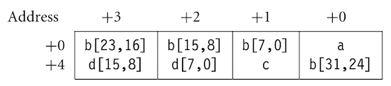

# 5 Efficient C Programming

---

## 5.7 Structure Alignment

구조체의 entry 정렬 여부는, 메모리 크기 및 효율성에 큰 영향을 미친다.

- 컴파일러는 구조체의 start address를, 'entry에서 가장 큰 데이터 타입의 배수'로 정렬한다. 

  > 따라서, 일반적으로 4 bytes 혹은 8 bytes로 정렬된다.

- 남는 메모리 공간에는 **padding**이 적용된다.

---

### 5.7.1 Reordering Structure Members

다음 예시는 다양한 데이터 타입으로 구성된 구조체를 갖는 메모리 공간이다.

- Example 1: entry 중 `int`(4 bytes)가 제일 크므로, start address는 4의 배수를 갖는다. (12 bytes)

- Example 2: 크기가 작은 데이터 타입부터 정렬하는 것으로 메모리 공간을 확보할 수 있다. (12 $\rightarrow$ 8 bytes)

<table>
<tr>
<td> 

Example 1

</td> 
<td> 

```c
struct {
  char  a;
  int   b;
  char  c;
  short d;
}
```

</td> 
<td> 


</td>
</tr>
<tr>
<td> 

Example 2<br>(Reordered)

</td> 
<td> 

```c
struct {
  char  a;
  char  c;
  short d;
  int   b;
}
```

</td>
<td> 


</td>
</tr>
</table>

---

### 5.7.2 Removing Padding

`__packed` 키워드를 사용하여, armcc 컴파일러가 구조체 내부에 padding을 적용하지 않도록 지시할 수 있다.

<table>
<tr>
<td> 

```c
__packed struct {
  char a;
  int b;
  char c;
  short d;
}
```

</td> 
<td> 



</td>
</tr>
</table>

하지만 이러한 구현은 데이터 접근에서 shift와 같이 추가적인 명령어를 필요로 하므로 비효율적이다. 

---

### 5.7.3 Inserting Padding

메모리 사용량을 제외한 성능 면에서는 명시적으로 padding을 삽입하는 것이 바람직하다. 다음은 명시적으로 padding을 삽입한 구조체 예시다.

```c
struct {
  char a;
  char padding1[3];
  int b;
  char c;
  char padding2[1];
  short d;
  ...
}
```

<blockquote>

별개로 `enum` 구조체 타입은, 컴파일러마다 데이터 크기를 다르게 취급하므로 주의해야 한다. 

- 예를 들어 armcc는 `bool` 타입을 1-byte로 취급하지만, gcc는 4-byte로 처리한다.

```c
typedef enum {
  FALSE,
  TRUE
} Bool;
```

</blockquote>

---

## 5.8 Unaligned Data and Endianness

정렬되지 않은 데이터와 Endian은 메모리 접근과 이식성(portability)에 영향을 미치므로 주의해야 한다. 특히 ARM의 load/store 명령어는, 메모리의 시작 주소가 데이터 타입의 정수 배임을 가정한다.

> 반면, 데이터 접근은 unaligned data를 대상으로도 가능하다.

- 컴파일러에게 `__packed` 지시자를 통해, 데이터가 임의로 정렬되어 있음(4의 배수가 아닐 수 있음)을 알릴 수 있다.

  > 단, 성능 면에서  `__packed`보다는 `char *`를 사용하는 편이 더 효율적이다.

<table>
<tr>
<td> C Code </td> <td> Assembly </td>
</tr>
<tr>
<td> 

```c
int readint(__packed int *data)
{
  return *data;
}


```

</td>
<td> 


```assembly
readint
            BIC r3,r0,#3
            AND r0,r0,#3
            MOV r0,r0,LSL #3 
            LDMIA r3,{r3,r12}
            MOV r3,r3,LSR r0
            RSB r0,r0,#0x20
            ORR r0,r3,r12,LSL r0 
            MOV pc,r14
```

</td>
</tr>
</table>

---

### 5.8.1 Endianness

ARM은 little-endian, big-endian을 모두 지원한다.

<table>
<tr>
<td> little endian </td> <td> big endian </td>
</tr>
<tr>
<td>

```c
int readint_little(char *data)
{
  int a0,a1,a2,a3;

  a0 = *(data++);
  a1 = *(data++);
  a2 = *(data++);
  a3 = *(data++);
  return a0|(a1<<8)|(a2<<16)|(a3<<24);
}
```

</td>
<td> 

```c
int readint_big(char *data)
{
  int a0,a1,a2,a3;

  a0 = *(data++);
  a1 = *(data++);
  a2 = *(data++);
  a3 = *(data++);
  return (((((a0<<8)|a1)<<8)|a2)<<8)|a3;
}
```

</td>
</tr>
<tr>
<td>


</td>
<td> 


</td>
</tr>
</table>

---

## 5.9 Division

ARM은 나눗셈 명령을 하드웨어 수준에서 제공하지 않으며, 대신 컴파일러에서 C 라이브러리 루틴으로 제공한다. 

- 하지만 표준 정수 나눗셈 루틴이 20~100 cycle을 소모할 만큼 비싼 연산이므로 가급적 피해야 한다.

  > implementation, early termination, input operands의 range 등 여러 요인에 따라 \#cycle은 달라진다.

다음과 같이 간단한 나눗셈 코드는 덧셈/뺄셈 명령으로 연산을 대체할 수 있다. 

> circular buffer를 위한 코드로, `increment` < `buffer_size`를 가정한다.

<table>
<tr>
<td> C Code(약 50 cycle) </td> <td> C Code(3 cycle) </td>
</tr>
<tr>
<td> 

```c
offset = (offset + increment) % buffer_size;


```

</td>
<td> 

```c
offset += increment;
if (offset>=buffer_size)
{
   offset -= buffer_size;
}
```

</td>
</tr>
</table>

만약 나눗셈을 피할 수 없다면, 분자와 분모의 데이터 타입으로 `unsigned int`를 사용하는 편이 낫다.

> signed division 루틴: 분자와 분모에 절댓값을 취한 뒤, unsigned 나눗셈 루틴을 호출하는 방식 (이후 결과의 부호를 수정)

---

### 5.9.1 Using Modulus, Remainder to Avoid Division

많은 C 라이브러리 루틴은 몫과 함께 나머지도 반환한다. 다음은 screen buffer에서 `offset` byte 만큼 떨어진 위치 좌표 (x, y)를 찾는 코드다.

<table>
<tr>
<td> C code </td> <td> Assembly </td>
</tr>
<tr>
<td>

```c
typedef struct {
  int x;
  int y;
} point;

point getxy_v1(unsigned int offset, unsigned int bytes_per_line)
{
  point p;
  p.y = offset / bytes_per_line;
  p.x = offset - p.y * bytes_per_line;
  return p;
}
```

</td>
<td> 

```assembly
getxy_v1
        STMFD   r13!,{r4-r6,r14}
        MOV     r6,r0
        MOV     r0,r2
        MOV     r5,r2
        MOV     r4,r1
        BL      __rt_udiv
        MUL     r1,r5,r0
        SUB     r1,r4,r1
        STR     r0,[r6,#4]
        STR     r1,[r6,#0]
        LDMFD   r13!,{r4-r6,pc}
```

</td>
</tr>
</table>


앞서 `p.x`를 나눗셈이 아닌 뺄셈과 곱셈으로 획득하므로 언뜻 효율적으로 보이지만, 나눗셈 루틴에서 반환하는 몫과 나머지를 함께 활용하면 더 효율적이다.

- C 라이브러리의 나눗셈 루틴은(`__rt_udiv`) 몫과 나머지는 함께 획득할 수 있다.

- `getxy_v1()` 함수에 비해 4개 명령어가 덜 필요하다.

<table>
<tr>
<td> C code </td> <td> Assembly </td>
</tr>
<tr>
<td>

```c
point getxy_v2(unsigned int offset, unsigned int bytes_per_line)
{
  point p;

  p.x = offset % bytes_per_line;
  p.y = offset / bytes_per_line;
  return p;
}
```

</td>
<td> 

```assembly
getxy_v2
        STMFD r13!,{r4, r14}  ; stack r4, lr
        MOV   r4,r0           ; move p to r4
        MOV   r0,r2           ; r0 = bytes_per_line
        BL    __rt_udiv       ; (r0,r1) = (r1/r0, r1%r0)
        STR   r0,[r4,#4]      ; p.y=offset / bytes_per_line
        STR   r1,[r4,#0]      ; p.x=offset % bytes_per_line
        LDMFD r13!,{r4,pc}    ; return
```

</td>
</tr>
</table>

---

## 5.10 Inline Functions and Inline Assembly

`#define`으로 함수 매크로를 정의할 수 있지만, 매크로보다는 `#inline`을 통한 inline function 구현이 효율적이다.

> 매크로는 preprocessor에 의해 코드에 삽입되며, 함수의 인자와 반환 타입을 체크하지 않는다.

<blockquote>

다음은 C 코드로 작성한 함수 매크로 예시다.

```c
#define CALC_MAX(a,b)    // 매크로 함수는 대체로 대문자
{
    if(a>b) c=a;
    else c=b;

}

int main(void):
{
    inc c,
    ...
    CALC_MAX(a,b);
}
```

</blockquote>

---

### 5.10.1 Inline Functions

다음은 16-bit 입력을 받아서 32-bit 출력을 계산하는, saturating doubling multiply-accumulate를 구현한 코드이다. (speech processing에서 종종 사용된다.)

- `sat_correlate()`: $a = 2x_0y_0 + \cdots + 2x_{N-1}y_{N-1}$ 계산

-  $x, y$ : 16-bit signed operands(`short`) $\rightarrow$ $a$ : 32-bit signed accumulator(`int`)

```c
int sat_correlate(short *x, short *y, unsigned int N)
{
  int a=0;

  do 
  {
    a = qmac(a, *(x++), *(y++));
  } while (--N);
  return a;
}
```

위 코드에서 $a + 2xy$ 를 계산하는 `qmac()` 함수는 내부적으로 inline 처리된다. (함수 호출 overhead 감소)

- `qmac()`: $a + 2xy$ 를 계산한다.

- 이때 32-bit 범위를 초과하면, nearest possible value으로 saturate된다.

```c
__inline int qmac(int a, int x, int y)
{
  int i;
  i = x*y; /* this multiplication cannot saturate */
  if (i>=0)
  {
    /* x*y is positive */
    i = 2*i;
    if (i<0)
    {
      /* the doubling saturated */
      i = 0x7FFFFFFF;
    }
    if (a + i < a) 
    {
      /* the addition saturated */
      return 0x7FFFFFFF;
    }
    return a + i; 
  }
  if (a + 2*i > a)
  {
    /* the accumulate saturated */
    return - 0x80000000;
  }
  return a + 2*i;
}
```

> 참고로 `x`, `y`를 Q15 fixed-point integers로 취급하는데, 이유는 각자 $x2^{-15}$ , $y2^{-15}$ 값을 표현하기 때문이다.

> 비슷하게 `a`는 Q31 fixed-point integer로, $a2^{-31}$ 값을 표현한다.

---

### 5.10.2 Inline Assembly

C 컴파일러의 **inline assembly**를 활용하면, 보다 넓은 영역까지 코드를 최적화할 수 있다.

- `__asm` 지시자를 사용하여 C 코드에 어셈블리 코드를 작성할 수 있다.

- C 코드에서 선언한 변수도 그대로 사용할 수 있다.

다음은 `qmac()` 함수의 비효율적인 if 조건문을, inline assembly로 최적화한 코드다. (ARMv5E 확장 명령어 활용)

> - `SMULBB{<cond>}{S} Rd, Rm, Rn`: 두 signed 16-bit 값을 곱한다. (레지스터의 bottom half를 취해서 곱)
>
> - `QDADD{<cond>}{S} Rd, Rm, Rn`: SAT(`Rm` + SAT(`Rn` * 2))를 수행한다.

<table>
<tr>
<td> C Code(+Inline Assembly) </td> <td> Assembly </td>
</tr>
<tr>
<td> 

```c
__inline int qmac(int a, int x, int y)
{
  int i;

  __asm
  {
    SMULBB i, x, y  /* multiply */
    QDADD  a, a, i  /* double + saturate + accumulate + saturate */
  }
  return a;
}

```

</td>
<td> 

```assembly
sat_correlate_v3
        STR    r14,[r13,#-4]!        ; stack lr
        MOV    r12, #0               ; a = 0
sat_v3_loop
        LDRSH  r3,[r0],#2            ; r3 = *(x++)
        LDRSH  r14,[r1],#2           ; r14 = *(y++)
        SUBS   r2,r2,#1              ; N-- and set flags
        SMULBB  r3,r3,r14            ; r3 = r3 * r14
        QDADD  r12,r12,r3            ; a = sat(a+sat(2*r3))
        BNE    sat_v3_loop           ; loop if N != 0
        MOV    r0,r12                ; r0 = a
        LDR    pc,[r13],#4           ; return r0
```

</td>
</tr>
</table>

다음은 Coprocessor 15의 instruction cache를 flush하는 코드다. (비슷한 방식으로 다른 Coprocessor도 접근할 수 있다.)

```c
void flush_Icache(void)
{
  #ifdef __ARMCC_VERSION /* armcc 버전 */
    __asm {MCR p15, 0, 0, c7, c5, 0}
  #endif
  #ifdef __GNUC__        /* gcc 버전 */
    __asm("MCR p15, 0, 0, c7, c5, 0");
  #endif
}
```

---