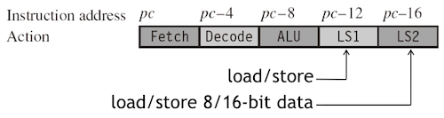
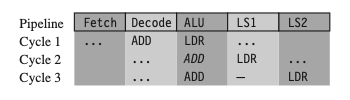
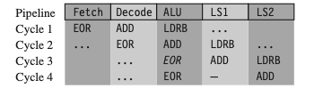
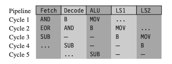

# 6 Writing and Optimizing ARM Assembly Code

C 코드 수준에서 최적화가 불가능한 영역에서, 다음과 같은 세 가지 어셈블리 코드 레벨의 최적화 기법을 적용할 수 있다.

| |  |
| --- | --- |
| (1) | **instruction scheduling** |
| (2) | **register allocation** |
| (3) | **conditional execution** |

> 어셈블러는 ARM macro assembler인 **armasm**을 사용한다.

> Thumb mode는 이번 chapter에서 다루지 않는다. 

---

## 6.1 Writing Assembly Code

ARM 어셈블리 코드를 익히기 위해, 먼저 예시를 통해 C 코드를 어셈블리 코드로 변환해 보자.

---

### 6.1.1 Convert C Function to Assembly Function

다음은 0~9까지 모든 정수의 제곱 값을 출력하는 `square()` 함수이다. C로 구현한 함수를 어셈블리 코드로 대체할 것이다.

> C 코드 내부에서는 함수의 선언만 남겨둔 채, armasm 어셈블리 파일(square.s)과 연결한다.

<table>
<tr>
<td> C code </td> <td> Assembly </td> <td> Assembly(Thumb mode) </td>
</tr>
<tr>
<td>

```c
#include <stdio.h>

int square(int i);

int main(void)
{
    int i;

    for (i=0; i<10; i++)
    {
        printf("Square of %d is %d\n", i, square(i));
    }
}

int square(int i)
{
    return i * i;
}
```

</td>
<td> 

```assembly
        AREA    |.text|, CODE, READONLY

        EXPORT  square

        ; int square(int i)
square
        MUL    r1, r0, r0    ; r1 = r0 * r0
        MOV    r0, r1        ; r0 = r1
        MOV    pc, lr        ; return r0
        END


```

</td>
<td> 

```assembly
        AREA    |.text|, CODE, READONLY

        EXPORT  square

        ; int square(int i)
square
        MUL    r1, r0, r0    ; r1 = r0 * r0
        MOV    r0, r1        ; r0 = r1
        BX     lr            ; return r0
        END


```

</td>
</tr>
</table>
 
> directive는 다음 의미를 갖는다.
>
>  | | | 
>  | --- | --- |
>  | `AREA` | 코드가 live in하는 섹션 정의 |
>  | `EXPORT` | external linking 수행 | 

<blockquote>

컴파일은 다음 명령으로 수행할 수 있다.

```bash
armcc -c main1.c
armasm square.s
armlink -o main1.axf main1.o square.o
```

</blockquote>

---

### 6.1.2 Call Subroutine from Assembly Routine

다음 예시를 통해, 어셈블리 루틴 내부에서 서브루틴을 호출하는 방법을 살펴보자. (어셈블리 코드에서 C 라이브러리 루틴 `printf`를 호출할 것이다.)

- `printf` 서브루틴 호출 시, 기존 루틴에서도 사용한 `r4`(`i`), `lr` 레지스터를 보존해야 한다.

<table>
<tr>
<td> Assembly </td> <td> Assembly(Thumb mode) </td>
</tr>
<tr>
<td> 

```assembly
        AREA    |.text|, CODE, READONLY

        EXPORT  main

        IMPORT  |Lib$$Request$$armlib|, WEAK
        IMPORT  __main       ; C library entry
        IMPORT  printf       ;
        
i       RN 4

        ; int main(int void)
main
        STMFD  sp!, {i, lr} 
        MOV    i, #0

loop
        ADR    r0, print_string MOV r1, i
        MUL    r2,i,i
        BL     printf
        ADD    i,i,#1
        CMP    i, #10
        BLT    loop
        LDMFD  sp!, {i, pc}

print_string
        DCB    "Square of %d is %d\n", 0
        END
```

</td>
<td> 

```assembly
        AREA    |.text|, CODE, READONLY

        EXPORT  main

        IMPORT  |Lib$$Request$$armlib|, WEAK
        IMPORT  __main       ; C library entry
        IMPORT  printf       ;
        
i       RN 4

        ; int main(int void)
main
        STMFD  sp!, {i, lr} 
        MOV    i, #0

loop
        ADR    r0, print_string MOV r1, i
        MUL    r2,i,i
        BL     printf
        ADD    i,i,#1
        CMP    i, #10
        BLT    loop
        LDMFD  sp!, {i, lr}   ; Thumb mode
        BX     lr             ; Thumb mode

print_string
        DCB    "Square of %d is %d\n", 0
        END
```

</td>
</tr>
</table>

> symbol, specifier, directive는 다음과 같은 의미를 갖는다.
>
> | | |
> | --- | --- |
> | `Lib$$Request$$armlib` symbol | 링커가 표준 ARM C 라이브러리와 링크하도록 요청 |
> | `WEAK` specifier | 링커에게 심볼을 찾지 못할 경우 무시하도록 요청 (대신 0 값을 사용) | 
> | `RN` directive | 레지스터 이름을 지정 (앞서, `r4` 대신 `i` 사용) |
> | `DCB` directive | byte data 정의 |

---

### 6.1.3 Pass More than Four Parameters

다음 예시는 여러 개의 인자를 전달 받는 함수(`sumof()`)이다.

- `N`: 리스트에서 합산을 수행할 값의 개수

- 처음 세 값은 레지스터 `r1-r3`에 위치하며, 나머지 값은 스택에 위치한다.

<table>
<tr>
<td> C code </td> <td> Assembly </td>
</tr>
<tr>
<td>

```c
#include <stdio.h>

/* N is the number of values to sum in list ... */
int sumof(int N, ...);

int main(void)
{
  printf("Empty sum=%d\n", sumof(0)); 
  printf("1=%d\n", sumof(1,1));
  printf("1+2=%d\n", sumof(2,1,2)); 
  printf("1+2+3=%d\n", sumof(3,1,2,3)); 
  printf("1+2+3+4=%d\n", sumof(4,1,2,3,4)); 
  printf("1+2+3+4+5=%d\n", sumof(5,1,2,3,4,5)); 
  printf("1+2+3+4+5+6=%d\n", sumof(6,1,2,3,4,5,6));
}


```

</td>
<td> 

```assembly
        AREA    |.text|, CODE, READONLY

        EXPORT  sumof

N       RN 0    ; number of elements to sum
sum     RN 1    ; current sum

        ; int sumof(int N, ...)
sumof
        SUBS    N, N, #1 
        MOVLT   sum, #0
        SUBS    N,N,#1 
        ADDGE   sum, sum, r2 
        SUBS    N, N, #1 
        ADDGE   sum, sum, r3 
        MOV     r2, sp
loop
        SUBS    N, N, #1 
        LDMGEFD r2!, {r3}
        ADDGE   sum, sum, r3
        BGE     loop
        MOV     pc, lr

        END
```

</td>
</tr>
</table>

---

## 6.2 Profiling And Cycle Counting

프로파일러(**profiler**)란, 각 서브루틴에 소요되는 latency 혹은 \#cycles을 측정하는 도구이다.

- 이를 활용하여 코드에서 가장 중요한 루틴(즉, 최적화할 루틴)을 식별할 수 있다.

- cycle-counting hardware: 특정 루틴의 수행에 필요한 cycle 수를 측정한다.

---

## 6.3 Instruction Scheduling

ARM은 단계별 pipelining을 통해 여러 명령을 병렬로 수행한다. 다음은 ARM의 대표적인 명령어가 파이프라인 내부에서 실행되는 데 필요한 \#cycle를 정리한 표이다.

> 가정: zero-wait-state memory for an uncached system, or a cache hit for a cached system

| instructions | \#cycles | note |
| --- | :---: | --- |
| ALU operations<br/>(addition, subtraction, logical) | 1 | |
| $N$ 32-bit Load instructions<br/>(e.g., $N$ 개 32-bit word 로드(`LDR`, `LDM`)) | $N$ | - 마지막에 적재한 값은 바로 다음 1 cycle 동안 사용 불가<br/>- single value `LDM` 명령은 예외적으로 2 cycle 소요<br/>- 명령어에서 `pc`를 로드하는 경우, 2 cycle 추가 소요 |
| 16-bit or 8-bit Load instructions<br/>(`LDR`, `LDRSB`, `LDRH`, `LDRSH`) | 1 | - 적재한 값은 다음 2 cycle 동안 사용 불가 |
| Branch instruction | 3 | |
| $N$ Store instruction | $N$ | - single value `STM` 명령은, 예외적으로 2 cycle 소요 |
| Multiply instructions | varying | - 2번째 operand에 따라 \#cycle 좌우 |

---

### 6.3.1 ARM9TDMI Pipeline

다음은 ARM9TDMI 프로세서의 5개 pipeline stage이다.

- **LS1** 단계: load/store 명령만 해당

- **LS2** 단계: 8-bit 혹은 16-bit halfward load 명령만 해당



| stage | description | note |
| --- | --- | --- | 
| (1) **Fetch** | `pc`가 가리키는 명령을 fetch | |
| (2) **Decode** | 직전 cycle에서 fetch한 명령을 decode | - data hazard를 방지하기 위한 **forwarding**(bypassing)이 없을 경우, register bank에서 input operands를 읽는다.  |
| (3) **ALU** | 직전 cycle에서 decode한 명령어를 execute <br> | - 일반적으로 data processing operation에서 필요한 연산이나, load, store, branch operation에 필요한 address 연산을 수행한다.<br>- Execute하는 명령은 `pc-8`(Thumb state의 경우 `pc-4`) 주소에 대응된다.<br/>- 일부 명령은 ALU에서 여러 사이클을 소비한다.(e.g., multiply and register-controlled shift operation) | 
| (4) **LS1** | 데이터를 load 혹은 store | |
| (5) **LS2** | byte 혹은 halfword load instruction에서 데이터 추출 후, zero(or signed) extend | |

> 파이프라인 5단계를 완료하면 결과는 레지스터 파일에 기록되며, `pc`는 'fetch'할 명령어 주소를 가리키게 된다.

---

### 6.3.2 Pipeline Hazard

현재 명령어에서 연산이 끝나지 않은 이전 명령어 결과가 필요한 경우, 파이프라인이 멈추는 **pipeline hazard**(**pipeline interlock**) 문제가 발생한다. 다음 예시를 살펴보자.

<table>
<tr>
<td colspan="2">  Example 1: no interlock (total 2 cycles) </td> 
</tr>
<tr>
<td> Assembly </td> <td> Description </td>
</tr>
<tr>
<td>

```assembly
ADD r0, r0, r1    
ADD r0, r0, r2

```

</td>
<td> 

| cycle | | |
| --- | --- | --- |
| 1 | (ALU) `r0 = r0 + r1` 계산 | |
| 2 | (ALU) 앞선 결과를 사용해 `r0 = r0 + r2` 계산 | |

</td>
</tr>
</table>

다음은 `LDR` 명령어를 포함한 파이프라인의 동작 예시다.

<table>
<tr>
<td colspan="2">  Example 2: one-cycle interlock caused by load use (total 3 cycles) </td> 
</tr>
<tr>
<td> Assembly </td> <td> Description </td>
</tr>
<tr>
<td>

```assembly
LDR r1, [r2, #4]  
ADD r0, r0, r1


```

</td>
<td> 

| cycle | | |
| --- | --- | --- |
| 1 | (ALU) `ADD` 명령을 병렬로 decode하면서, `LDR` 명령의 주소 `r2 + 4`를 계산 | |
| 2 | `LDR` 명령에서 아직 `r1` 값을 로드하지 않았으므로 `ADD` 명령 진행 불가 | **(stall 발생)** |
| 3 | `r1`이 준비된 세 번째 cycle에서, ALU가 `ADD` 명령을 실행 | |

</td>
</tr>
</table>

> 

> 프로세서는 로드 명령이 LS1 단계를 완료하는 동안 파이프라인의 ALU 단계에서 한 사이클 동안 ADD 명령 정지(이탤릭체 ADD로 표시한 부분) 

> LDR 명령은 파이프라인을 따라 진행되지만 ADD 명령은 멈춰 있기 때문에 두 명령 사이에 간격이 생긴다. 이 간격을 **pipeline bubble**이라고 부른다.

다음은 byte load instruction인 `LDRB`를 포함한 파이프라인의 동작 예시다.

<table>
<tr>
<td colspan="2">  Example 3: one-cycle interlock caused by delayed load use (total 4 cycles) </td> 
</tr>
<tr>
<td> Assembly </td> <td> Description </td>
</tr>
<tr>
<td>

```assembly
LDRB r1, [r2, #1] 
ADD  r0, r0, r2 
EOR  r0, r0, r1


```

</td>
<td> 

| cycle | | |
| --- | --- | --- |
| 1 | (ALU) `ADD` 명령을 병렬로 decode하면서, `LDRB` 명령의 주소 `r2 + 1`를 계산 | |
| 2 | `ADD` 명령 수행<br/>(해당 `ADD` 명령은 `r1`을 사용하지 않으므로, 어떤 stall도 일으키지 않는다.) |  |
| 3 | `LDRB` 명령에서 아직 `r1` 값을 로드하지 않았으므로(LS2 단계 미완료) `EOR` 명령 진행 불가 | **(stall 발생)** |
| 4 | `r1`이 준비된 4 번째 cycle에서, ALU가 `EOR` 명령을 실행 | |

</td>
</tr>
</table>

> 

다음은 분기 명령어 `B`를 포함한 파이프라인의 동작 예시다. 분기 명령어에 3 cycle이 필요한 이유를 다음 예시를 통해 살펴보자.

- 새로운 주소로 jump할 때, 파이프라인을 flush해야 한다. (리필: 2 cycle 소요)

<table>
<tr>
<td colspan="2">  Example 4: branch instructions (total 5 cycles) </td> 
</tr>
<tr>
<td> Assembly </td> <td> Description </td>
</tr>
<tr>
<td>

```assembly
        MOV r1, #1
        B   case1
        AND r0, r0, r1 
        EOR r2, r2, r3 
        ...
case1
        SUB r0, r0, r1

```

</td>
<td> 

| cycle | | |
| --- | --- | --- |
| 1 | `MOV` 명령어 실행 | |
| 2 |  분기 명령어는 target address를 계산 | **(분기에 의해 stall 발생)** |
| 3 |  파이프라인을 플러시하고 새로운 PC 값에 따라 파이프라인을 다시 채운다 | **(stall)** |
| 4 | - | |
| 5 | `SUB` 명령이 정상적으로 실행된다. | |

</td>
</tr>
</table>

> 

---
