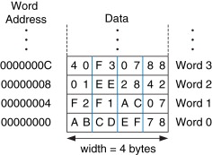
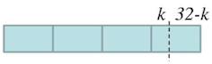

# 6 Writing and Optimizing ARM Assembly Code

대부분의 범용 레지스터 번호는 특별한 역할이 없지만, 함수 호출(**Procedure call**)을 비롯한 상황에서 특정한 규칙을 염두해야 한다. 

---

## 6.4 Register Allocation

16개 visible ARM 레지스터 중 14개 레지스터만을 데이터를 저장하기 위한 목적으로 사용할 수 있다.

- 제외된 레지스터: stack pointer `sp` (`r13`), program counter `pc` (`r15`)

---

### 6.4.1 Procedure Call

> [ARM-Thumb Procedure Call Standard (ATPCS)](https://developer.arm.com/documentation/dui0056/d/using-the-procedure-call-standard/about-the-arm-thumb-procedure-call-standard), [Procedure Call Standard for Arm Architecture (AAPCS)](https://developer.arm.com/documentation/107656/0101/Getting-started-with-Armv8-M-based-systems/Procedure-Call-Standard-for-Arm-Architecture--AAPCS-)

함수 인자(**arguments**)와 반환 값(**return value**)을 저장하기 위해, ARM 아키텍처에서는 다음과 같이 레지스터를 활용한다.

- `r0-r3`에 저장되는 네 개 인자 이외의 값은 **stack**에 저장된다. (= 성능을 위해서 인자를 적게 두어야 하는 이유)

  | register | description |
  | --- | --- |
  | `r0-r3` | 함수의 첫 네 개 인자를 저장 |
  | `r0` | 함수의 반환 값을 저장 |

- `r4-r11`은 variable을 저장하며, 호출된 함수에서 해당 레지스터를 사용하려면 stack에 백업하는 과정이 필요하다. (이후 복구)

  ```assembly
      STMFD   sp!, {r4-r12, lr}        ; save registers on stack
      ...
      LDMFD   sp!, {r4-r12, pc}        ; restore registers
  ```

  > `r12`까지 추가로 백업하는 이유: stack을 8byte 단위로 정렬하기 위함이다. (ATPCS 규칙)

---

### 6.4.2 Allocating Variables to Register Numbers

> 사용 가능한 14개 레지스터에 어떻게 변수를 할당할 것인가?

다음은 $N$ bit 크기의 배열을, $k$ bit만큼 shifting하는 코드이다. (입력 및 출력 포인터가 word aligned되어 있다고 가정)

- $N$ : 256의 배수(8 words)라고 가정,  $k$ : $0 \le k < 32$ 로 가정

- 8 word 단위로 loop unrolling하여 최적화할 것이다.

  

  

| code | description |
| --- | --- |
| (1) `x = *in++;` | 배열에서 x를 읽어와서 x에 저장(\*in++로 포인터는 다음 word로 이동) |
| (2) `*out++ = (x << k) \| carry;` | x를 k만큼 왼쪽으로 shift한 후,<br>이전 값에서 넘어온 carry 비트를 OR 연산으로 결합 (출력: out 배열에 저장) |
| (3) `carry = x >> (32 - k);` | x를 오른쪽으로 32-k만큼 shift하여 carry 도출 |

<table>
<tr>
<td> C code </td> <td> Assembly </td>
</tr>
<tr>
<td>

```c
// *in: input array pointer
// *out: output array pointer
// x: value to be shifted(from *in)
unsigned int shift_bits(unsigned int *out, unsigned int *in,
                        unsigned int N, unsigned int k)
{
  unsigned int carry=0, x;
  do 
  {
    x = *in++;
    *out++ = (x<<k) | carry;
    carry = x>>(32-k);
    N -= 32;
  } while (N);

  return carry;
}


```

</td>
<td> 

```assembly
shift_bits
        STMFD sp!, {r4-r11, lr}
        RSB   kr, k, #32                 ; kr = 32-k
        MOV   carry, #0 
loop
        LDMIA in!, {x_0-x_7}             ; load 8 words
        ORR   y_0, carry, x_0, LSL k     ; shift 8 words
        MOV   carry, x_0, LSR kr
        ORR   y_1, carry, x_1, LSL k 
        MOV   carry, x_1, LSR kr
        ORR   y_2, carry, x_2, LSL k 
        MOV   carry, x_2, LSR kr
        ORR   y_3, carry, x_3, LSL k 
        MOV   carry, x_3, LSR kr
        ORR   y_4, carry, x_4, LSL k 
        MOV   carry, x_4, LSR kr
        ORR   y_5, carry, x_5, LSL k 
        MOV   carry, x_5, LSR kr
        ORR   y_6, carry, x_6, LSL k 
        MOV   carry, x_6, LSR kr
        ORR   y_7, carry, x_7, LSL k 
        MOV   carry, x_7, LSR kr 
        STMIA out!, {y_0-y_7}           ; store 8 words
        SUBS  N, N, #256                ; N -= (8 words * 32 bits)
        BNE   loop                      ; if (N!=0) goto loop
        MOV   r0, carry                 ; return carry
        LDMFD sp!, {r4-r11, pc}
```

</td>
</tr>
</table>

> load multiple 명령어 특성상, $x_0-x_7$ 와 $y_0-y_7$ 은 순차적인 레지스터 번호를 가져야 한다.

그런데 여기서 $y_{n+1}$ 은 $x_n$ 레지스터에 할당할 수 있다. $y_{n+1}$ 사용 전에 $x_n$ 사용이 끝나기 때문이다. (최적화 1)

```assembly
out   RN 0 
in    RN 1
N     RN 2 
k     RN 3

x_0   RN 5
x_1   RN 6
x_2   RN 7
x_3   RN 8
x_4   RN 9
x_5   RN 10
x_6   RN 11
x_7   RN 12
y_0   RN 4
y_1   RN x_0
y_2   RN x_1
y_3   RN x_2
y_4   RN x_3
y_5   RN x_4
y_6   RN x_5
y_7   RN x_6
```

> 구현을 마무리하기 위해서는 두 변수(carry와 kr)를 할당하여야 한다. 그러나 현재 사용할 수 있는 레지스터는 `lr`(`r14`) 하나뿐이다. (6.4.1절의 설명처럼, `STMFD sp!, {r4-r11, lr}` 명령으로 백업해 두었기 때문에 활용 가능)

이처럼 레지스터가 부족한 상황에서는 다음과 같은 방법을 적용할 수 있다.

1. loop unrolling의 크기를 줄인다. 

2. stack에 가장 적게 참조하는 변수를 저장 (예를 들면 loop counter `N`을 백업)

3. 코드 최적화 

---

#### 6.4.2.1 Code Implementation to Reduce Register Usage

여기서는 carry 값을 항상 동일한 레지스터에 둘 필요가 없다는 점을 활용할 것이다. (최적화 2)

- 처음에는 carry 값을 $y_0$ 레지스터에 저장, 이후 $y_1$ 로 이동 ( $x_0$ 사용이 끝났을 때 )

- 마지막으로 kr(= 32-k)을 `lr`에 할당하여, carry 값이 필요하지 않도록 코드를 구성한다.

```assembly
kr      RN lr

        ; void shift_bits(unsigned *out, unsigned *in, int N, int k)
shift_bits
        STMFD   sp!, {r4-r11, lr}       ; save registers
        RSB     kr, k, #32              ; kr = 32-k;
        MOV     y_0, #0                 ; initial carry
loop    
        LDMIA   in!, {x_0-x_7}          ; load 8 words
        ORR     y_0, y_0, x_0, LSL k    ; shift the 8 words
        MOV     y_1, x_0, LSR kr        ; recall x_0 = y_1
        ORR     y_1, y_1, x_1, LSL k 
        MOV     y_2, x_1, LSR kr
        ORR     y_2, y_2, x_2, LSL k 
        MOV     y_3, x_2, LSR kr
        ORR     y_3, y_3, x_3, LSL k 
        MOV     y_4, x_3, LSR kr
        ORR     y_4, y_4, x_4, LSL k 
        MOV     y_5, x_4, LSR kr
        ORR     y_5, y_5, x_5, LSL k 
        MOV     y_6, x_5, LSR kr
        ORR     y_6, y_6, x_6, LSL k 
        MOV     y_7, x_6, LSR kr
        ORR     y_7, y_7, x_7, LSL k 
        STMIA   out!, {y_0-y_7}         ; store 8 words
        MOV     y_0, x_7, LSR kr
        SUBS    N, N, #256              ; N -= (8 words * 32 bits)
        BNE     loop                    ; if (N!=0) goto loop;
        MOV     r0, y_0                 ; return carry;
        LDMFD   sp!, {r4-r11, pc}
```

---
