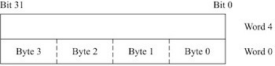
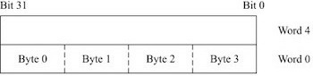
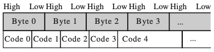
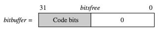

# 6 Writing and Optimizing ARM Assembly Code

---

## 6.7 Bit Manipulation

압축 파일 형식에서는 데이터 밀도를 최대화하기 위해 항목을 비트 단위로 packing한다. bitstream을 효율적으로 packing 및 unpacking하는 방법을 살펴보자.

- length field나 version field와 같은 고정 너비일 수도 있고, Huffman coding과 같은 가변 너비일 수도 있다. 

  > Huffman coding: 자주 등장하는 symbol은 짧은 bit-width를 갖고, 드문 symbol은 긴 bit-width를 갖게 된다.

---

### 6.7.1 Fixed-Width Bit Field Packing And Unpacking

`r0` 레지스터 내부 4-15 bit를, `r1` 레지스터에 unpack하는 예시를 살펴보자.

<table>
<tr>
<td> Case </td> <td> Assembly </td> 
</tr>
<tr>
<td>

Unsigned Unpack(with mask)<br/>(1 cycle)

</td>
<td> 

```assembly
        ; mask=0x00000FFF
AND     r1, mask, r0, LSR#4
```

</td>
</tr>
<tr>
<td>

Unsigned Unpack(no mask)<br/>(2 cycle)

</td>
<td> 

```assembly
MOV     r1, r0, LSL#16   ; discard bits 16-31
MOV     r1, r1, LSR#20   ; discard bits 0-3 and zero extend
```

</td>
</tr>
<tr>
<td>

Signed Unpack<br/>(bit field $\neq$ MSB이면, 항상 2 cycle)

</td>
<td> 

```assembly
MOV     r1, r0, LSL#16   ; discard bits 16-31
MOV     r1, r1, ASR#20   ; discard bits 0-3 and sign extend
```

</td>
</tr>
</table>

다음은 `r1` 레지스터의 12-bit 숫자를, `r0` 레지스터의 bit 4 위치에 packing하는 코드다.

> `BIC{<cond>}{S} Rd, Rn, N`: logical bit clear(AND NOT) 명령으로, `Rd=Rn&~N`으로 동작한다.

<table>
<tr>
<td> Case </td> <td> Assembly </td> 
</tr>
<tr>
<td>

`r1` 값 올바른 패킹 위치,<br/>동시에 `r0` 필드 빈 경우<br/>(1 cycle)

</td>
<td> 

```assembly
; pack r1 into r0
ORR     r0, r0, r1, LSL #4
```

</td>
</tr>
<tr>
<td>

Otherwise(=mask 필요)<br/>(최소 3 cycle)

</td>
<td> 

```assembly
        ; mask=0x00000FFF
AND     r1, r1, mask           ; r1: 12-bit 값만 갖도록 masking
BIC     r0, r0, mask, LSL#4    ; r0: 4-15 bit clear
ORR     r0, r0, r1,   LSL#4    ; r0: 4-15 bit에 r1 값 packing
```

</td>
</tr>
</table>

---

### 6.7.2 Variable-Width Bitstream Packing

가변 길이 코드(보통 Huffman 혹은 arithmetic coding)를 압축하여 bitstream을 생성할 것이다.

- 이때, packing Endian에 유의하여 packing해야 한다.

  > Remark(**Endian**)
  > | Little-Endian | Big-Endian |
  > | :---: | :---: |
  > |  |  |

  > 참고로 다수의 압축 포맷에서 **Big-Endian** 방식의 비트 패킹을 사용한다.
  >
  > 

---

#### 6.7.2.1 Example of Variable-Width Bitstream Packing

다음은 가변 길이 code를 packing하여, bitstream을 생성하는 코드다.

- code를 packing하는 과정에서, 32 bit 레지스터를 버퍼로 사용한다.(`bitbuffer`)

- `bitbuffer` 내 free bit 수를 기록하기 위한, 변수 `bitsfree`도 필요하다.

   > `bitsfree` = 이전 시점 `bitsfree` - `codebits`

  

```assembly
bitstream       RN 0           ; current byte address in the output bitstream
code            RN 4           ; current code
codebits        RN 5           ; length in bits of current code
bitbuffer       RN 6           ; 32-bit output big-endian bitbuffer
bitsfree        RN 7           ; number of bits free in the bitbuffer
tmp             RN 8           ; scratch register
mask            RN 12          ; endian reversal mask 0xFFFF00FF

                ; 바이트 정렬
bitstream_write_start               
        MOV     bitbuffer, #0                       
        MOV     bitsfree,  #32

align_loop
        TST     bitstream, #3                       ; bitstream 주소가 align되어 있는지 확인
        LDRNEB  code, [bitstream, #-1]!             ; unaligned 시, bitstream-1 주소 값 1 byte load 후 wb
        SUBNE   bitsfree, bitsfree, #8              ;      〃     , bitsfree -= 8 
        ORRNE   bitbuffer, code, bitbuffer, ROR #8  ;      〃     , bitbuffer=code|(bitbuffer, ROR8)
        BNE     align_loop                          ;      〃     , align_loop 반복
        MOV     bitbuffer, bitbuffer, ROR #8
        MOV     pc, lr

                ; 코드 삽입
bitstream_write_code                
        SUBS    bitsfree, bitsfree, codebits        ; bitsfree -= codebits
        BLE     full_buffer                         ; bitsfree <= codebits이면, full_buffer로 이동
        ORR     bitbuffer, bitbuffer, code, LSL bitsfree   ; 여유가 있으면 bitbuffer에 기록
        MOV     pc, lr

full_buffer
        RSB     bitsfree, bitsfree, #0                      ; 음수인 bitsfree를 양수로 전환(=0 - bitsfree)
        ORR     bitbuffer, bitbuffer, code, LSR bitsfree    ; bitsfree 여유 만큼만 code 기록
        IF {ENDIAN}="little"
          ; byte reverse the bit buffer prior to storing
          EOR   tmp, bitbuffer, bitbuffer, ROR #16
          AND   tmp, mask, tmp, LSR #8
          EOR   bitbuffer, tmp, bitbuffer, ROR #8
        ENDIF
        STR     bitbuffer, [bitstream], #4          ; bitbuffer 값 mem32[bitstream] 저장 (이후 주소 += 4)
        RSB     bitsfree, bitsfree, #32             ; bitsfree = 32-bitsfree
        MOV     bitbuffer, code, LSL bitsfree       ; 나머지 code 저장
        MOV     pc, lr

                ; 남은 바이트 저장
bitstream_write_flush               
        RSBS    bitsfree, bitsfree, #32             ; bitsfree = 32 - bitsfree

flush_loop
        MOVGT   bitbuffer, bitbuffer, ROR #24       ; bitsfree < 32일 경우,(bitsfree: 음수가 되면 32보다 커짐) 
        STRGTB  bitbuffer, [bitstream], #1          ; 1 바이트씩 저장
        SUBGTS  bitsfree, bitsfree, #8              ; bitsfree -= 8
        BGT     flush_loop                          ; bitsfree > 8이면, flush_loop 반복
        MOV     pc, lr
```

> `bitstream`은 워드 정렬을 필요로 하지 않으므로, 압축된 파일 대상으로 워드 엑세스는 불가능하다.

<blockquote>
<p>
다음 코드로 위 packing 코드를 실험해 볼 수 있다. (mask는 Little-Endian에서 사용)<br>

> `MVN{<cond>}{S} Rd, N`: `Rd=~N`

```assembly
        ; char *bitstream_write_test(char *bitstream, int *codes, char *code_lens)
bitstream_write_test
        STMFD   sp!, {r4-r11, lr}
        MVN     mask, #0x0000FF00         ; 0x0000FF00 = 00000000000000001111111100000000
        BL      bitstream_write_start     ; bitstream(align 점검 후, 필요 시 정렬), bitbuffer 초기화

write_next_code
        LDR     code, [codes], #4         ; 다음 code(32-bit) load,   (이후 codes 주소 += 4)
        LDRB    codebits, [code_lens], #1 ; 다음 codebits load (이후 code_lens 주소 += 1)
        BL      bitstream_write_code      ; bitstream 기록
        CMP     codebits, #N              ; N과 codebits 비교
        BLE     write_next_code           ; codebits <= N이면 다시 loop
        BL      bitstream_write_flush     ; bitstream_write_flush로 이동
        LDMFD   sp!, {r4-r11, pc}
```

</p>
</blockquote>

---

### 6.7.3 Variable-Width Bitstream Unpacking

가변 길이 코드의 bitstream packing보다도, 압축을 푸는 unpacking 작업이 훨씬 더 어렵다. (특히 대부분의 경우, 압축을 풀고 있는 code의 길이를 알 수 없어서 어렵다.)

- 언패킹 프로세스의 속도를 높이기 위해, **lookup table**(LUT, 룩업 테이블)을 사용한다.

  > 예를 들어, 허프만 코드 시퀀스에서 패킹 코드는 짧고 희귀 코드는 길다. LUT를 사용하여 대부분의 코드를 빠르게 unpack할 수 있다.

loop마다 MSB $N$ bits를 대상으로, 각각 $2^N$ 개 entry를 갖는 두 개의 LUT(codebits, code) 조회를 수행한다. 단, 두 가지 예외 상황에서는 `empty_buffer_or_long_code`를 호출하여 처리한다.

| | table return | example code label |
| --- | --- | --- |
| N bit: code를 결정하기에 충분 | 코드 길이, 코드 값. | 버퍼 내 남은 $N$ 충분: `bitstream_read_code`<br/> 버퍼 내 비트 부족(예외): `empty_buffer_or_long_code` |
| N bit: code를 결정하기에 불충분(예외) | 0xFF escape | `long_code` |

> 0xFF escape: 해당 케이스가 예외적인 경우임을 나타내는 단순한 플래그 값

---

#### 6.7.3.1 Example of Variable-Width Bitstream Unpacking

다음 예제는 루프마다 MSB 8 bit( $=N$ )를 각각 $2^8$ 개 entry를 갖는 LUT(`look_codebits[]` 및 `look_code[]`)를 조회하면서, 디코딩된 code를 획득한다.

- `bitsleft`: 조회할 MSB $N$ 비트를 제외한, 버퍼 내 남은 비트 수
 
  > `bitsleft` $\ge 0$ 일 때만, 다음 조회를 수행할 수 있다.
  
  

-  bitsleft가 0보다 작은 두 가지 case는, `empty_buffer_or_long_code` 함수를 호출하여 양쪽 다 처리할 수 있다.

   | | | |
   | --- | --- | --- |
   | (i)  | `bitsleft` 부족  | `bitbuffer`가 비어서, 다음 code를 조회할 수 없는 경우 |
   | (ii) | $N$ bits만으로 unpack 불가 | 필요한 코드가 $N$ 비트보다 긴 경우<br/>(`look_codebits`에서 escape 값 0xFF 반환) |

```assembly
bitstream     RN 0      ; current byte address in the input bitstream
look_code     RN 2      ; current byte address in the input bitstream
look_codebits RN 3      ; lookup table to convert next N bits to a code length
code          RN 4      ; code read
codebits      RN 5      ; length of code read
bitbuffer     RN 6      ; 32-bit input buffer (big endian)
bitsleft      RN 7      ; number of valid bits in the buffer - N
tmp           RN 8      ; scratch
tmp2          RN 9      ; scratch
mask          RN 12     ; N-bit extraction mask (1<<N)-1

N             EQU 8     ; use a lookup table on 8 bits (N must be <= 9)

        ; bitbuffer, bitsleft 초기화
bitstream_read_start
        MOV     bitsleft, #32

read_fill_loop
        LDRB    tmp, [bitstream], #1               ; bitstream에서 1 byte load (이후 주소 += 1)
        ORR     bitbuffer, tmp, bitbuffer, LSL#8   ; (bitbuffer, LSL#8) 후 8 bit(tmp) 기록
        SUBS    bitsleft, bitsleft, #8             ; bitsleft -= 8
        BGT     read_fill_loop                     ; bitsleft > 8이면, read_fill_loop 반복
        MOV     bitsleft, #(32-N)                  ;      모두 채웠다면, bitsleft 초기화(32-N)
        MOV     mask, #(1 << N)-1                  ; mask 생성
        MOV     pc, lr

        ; 호출마다 decoded code 리턴
bitstream_read_code
        LDRB    codebits, [look_codebits, bitbuffer, LSR#(32-N)]  ; MSB 8bit look_codebits 조회하여 codebits 획득
                                                                  ; 참고: long_code일 경우, escape 0xFF 반환
        AND     code, mask, bitbuffer, LSR#(32-N)                 ; MSB 8bit의 code 획득(mask 사용 이유: 6.7.1절)
        LDR     code, [look_code, code, LSL#2]                    ; look_code 조회 후 unpack code(32bit) 획득
                                                                  ; (4byte 단위로 읽으므로, LSL#2 적용)
        SUBS    bitsleft, bitsleft, codebits                      ; bitsleft -= codebits
        BMI     empty_buffer_or_long_code                         ; bitsleft < codebits일 경우, 해당 label로 분기
                                                                  ; 참고: BMI(Branch if MInus. N flag 시 분기)
        MOV     bitbuffer, bitbuffer, LSL codebits                ; 처리한 code의 codebits 수만큼 bitbuffer shift
        MOV     pc, lr

        ; 두 가지 예외 case 처리
empty_buffer_or_long_code
        TEQ     codebits, #0xFF
        BEQ     long_code                                         ; escape 0xFF일 경우, long_code로 분기
        ; empty buffer - fill up with 3 bytes
        ; as N <= 9, we can fill 3 bytes without overflow         ; (이하, 버퍼 내 다음 조회할 N bit가 부족한 경우)
        LDRB    tmp,  [bitstream], #1                             ; bitstream 1 byte load (이후 주소 += 1)
        LDRB    tmp2, [bitstream], #1                             ;                〃
        MOV     bitbuffer, bitbuffer, LSL codebits                ; codebits 수만큼 bitbuffer left shift
        LDRB    codebits, [bitstream], #1                         ; 활용 끝난 codebits에 1 byte load
        ORR     tmp, tmp2, tmp, LSL#8                             ; tmp: tmp2, (tmp, LSL#8) 기록
        RSB     bitsleft, bitsleft, #(8-N)                        ; bitsleft = (8-N)-bitsleft
                                                                  ; (이전 bitsleft: 음수)
        ORR     tmp, codebits, tmp, LSL#8                         ; tmp: 3 byte 기록
        ORR     bitbuffer, bitbuffer, tmp, LSL bitsleft           ; 버퍼 내 남은 bit + 3 byte 이어서 연결
        RSB     bitsleft, bitsleft, #(32-N)                       ; bitsleft = (32-N)-bitsleft
        MOV     pc, lr

        ; N bit 이상 필요한 code 처리
long_code
        ; long_code 구현은 application마다 따라 다르다.
        ; 예제는 단순히 code를 -1로 리턴만 수행
        MOV     code, #-1
        MOV     pc, lr
```

<blockquote>
<p>
다음 코드로 위 packing 코드를 실험해 볼 수 있다.<br>

```assembly
        ; int *bitstream_read_test(char *bitstream, int *codes,
        ;                          int *look_code, char *look_codebits)
bitstream_read_test
        STMFD   sp!, {r4-r11, lr}
        BL      bitstream_read_start    ; bitstream(필요 시 정렬 수행), bitbuffer 초기화

read_next_code        
        BL      bitstream_read_code     ; bitstream을 읽고 code 반환
        CMP     code, #-1               ; 리턴 code 값 점검 (long_code case는 code = -1 반환)
        STRNE   code, [codes], #4       ; long_code가 아니면, code를 codes에 저장 (이후 codes 주소 += 4)
        BNE     read_next_code          ;       〃        , read_next_code 반복
        MOV     r0, codes               ; codes return 위한 r0 설정
        LDMFD   sp!, {r4-r11, pc}
```

</p>
</blockquote>

> packing과 unpacking 두 코드 모두 inline으로 처리하면, 성능을 더욱 향상시킬 수 있다.

---

## 6.8 Efficient Switches

**switch**(multiway branch)는 여러 가지 동작 중에서 하나를 선택하는 조건문이다.

---

### 6.8.1 Switches on the Range 0 ≤ x < N

다음은 변수 $x$ ( $0 \le x < 8$ ) 에 따라 동작이 달라지는 switch 코드이다. 분기할 메서드 주소를 absolute address를 사용하는가, relative address를 사용하는가에 따라 구현 방법이 달라진다.


<table>
<tr>
<td> 방법 </td> <td>  </td> <td>  </td> 
</tr>
<tr>
<td rowspan="2">

`switch_absolute`

</td> 
<td colspan="2">  

함수 포인터가 있는 인라인 테이블을 두어, 조건에 맞는 메서드에 접근한다. (`DCD` directive를 통해 함수 주소를 정의)

</td> 
</tr>
<tr>
<td> 

장/단점

</td>
<td> 

- (+) 매우 빠르다.

- (-) 메서드의 absolute address를 메모리에 저장하기 때문에, position independent하지 않다.
  > 문제는 position independent한 코드(e.g., 런타임 중 시스템에 설치되는 모듈에서 종종 사용)에 적용할 수 없다.

</td>
</tr>
<tr>
<td rowspan="2">

`switch_relative`

</td> 
<td colspan="2">  

`pc`를 기준으로 relative address를 계산하여 메서드에 접근(`B` 분기 명령어 사용)

</td> 
</tr>
<tr>
<td> 

장/단점

</td>
<td> 

- (+) position independent에서 사용할 수 있다.

- (-) 분기 명령어 사용으로 인해 `switch_absolute`보다 느리다.

</td>
</tr>
</table>

다음은 위 두 가지 방식으로 구현한 switch 코드이다.

- `switch_absolute` 코드의 파이프라인에서, `pc`는 `LDR` 명령을 execute할 시점에 `method_0` word를 가리킨다.

- `LSL#4`: 명령어 주소는 4 byte 단위로 정렬되어 있기 때문에, `pc` offset은 4 byte 단위로 더해야 한다.

<table>
<tr>
<td> C code </td> <td> Assembly(switch_absolute) </td> <td> Assembly(switch_relative) </td>
</tr>
<tr>
<td>

```c
int ref_switch(int x)
{
  switch (x) 
  {
    case 0: return method_0();
    case 1: return method_1();
    case 2: return method_2();
    case 3: return method_3();
    case 4: return method_4();
    case 5: return method_5();
    case 6: return method_6();
    case 7: return method_7();
    default: return method_d();
  } 
}


```

</td>
<td> 

```assembly
x RN 0

    ; int switch_absolute(int x)
switch_absolute
    CMP     x, #8
    ; pc: pc+x<<4 값을 load하여 이동
    LDRLT   pc, [pc, x, LSL#2]
    B       method_d
    DCD     method_0
    DCD     method_1
    DCD     method_2
    DCD     method_3
    DCD     method_4
    DCD     method_5
    DCD     method_6
    DCD     method_7


```

</td>
<td> 

```assembly


    ; int switch_relative(int x)
switch_relative
    CMP     x, #8
    ; pc: 상대 주소 이동 -> B로 분기
    ADDLT   pc, pc, x, LSL#2
    B       method_d
    B       method_0
    B       method_1
    B       method_2
    B       method_3
    B       method_4
    B       method_5
    B       method_6
    B       method_7


```

</td>
</tr>
</table>

> 메서드 함수가 짧은 경우, 메서드 내부 명령을 모두 inline하는 대안을 고려할 수 있다.

---

### 6.8.2 Switches on a General Value x

$x$ 가 단순한 범위에 속하지 않는 경우, **hash function**를 활용하면 switch 구문을 효율적으로 구현할 수 있다.

> hash function: $x$ 를 $0 \le y < N$ 형태의 연속 범위로 매핑하는 $y= f(x)$ 함수
>
> - 단, 두 개 이상의 $x$ 값이, 동일한 $y$ 값에 매핑되는 충돌이 발생할 수 있어 주의해야 한다. 

---

#### 6.8.2.1 Example of Switches on a General Value x

$x = 2^k$ 를 만족하는 $x$ 를 대상으로, hash function를 활용해 switch 문을 구현한 코드다. 

- $x=2^k=\{1, 2, 4, 8, 16, 32, 64, 128\}$ 에 대응되는 `method_k` 를 호출한다.

- hash function

  $15 \times 31 \times x$ 연산 시, 8개 $x$ 값은 9-11 bit에서만 다른 값을 갖는다.

  | $k$ | 0 | 1 | 2 | 3 | 4 | 5 | 6 | 7 |
  | :---: | :---: | :---: | :---: | :---: | :---: | :---: | :---: | :---: |
  | $x$ | 1 | 2 | 4 | 8 | 16 | 32 | 64 | 128 |
  | 9-11 bits | 001 | 011 | 111 | 110 | 101 | 010 | 100 | 000 |

  > $2^k-1$ 값의 곱셈은 효율적으로 구현할 수 있다. 예를 들어 `x*15`는, `x*16(shift)-x(sub)`로 두면 1 cycle로 구현 가능하다. 

```assembly
x       RN 0 
hash    RN 1

        ; int switch_hash(int x)
switch_hash
        RSB     hash, x, x, LSL#4         ; hash = x*15    (= x*16-x)
        RSB     hash, hash, hash, LSL#5   ; hash = x*15*31 (= x*15*32-x*15)
        AND     hash, hash, #7 << 9       ; 9-11 bit만 mask를 통해 획득
        ADD     pc, pc, hash, LSR#6       ; pc += (hash >> 6)
        NOP                               ; padding(branch hazard 방지)
        TEQ     x, #0x01                  ; x = 1 점검
        BEQ     method_0                  
        TEQ     x, #0x02                  ; x = 2 점검
        BEQ     method_1
        TEQ     x, #0x40                  ; x = 64 점검
        BEQ     method_6
        TEQ     x, #0x04                  ; x = 4 점검
        BEQ     method_2
        TEQ     x, #0x80                  ; x = 128 점검
        BEQ     method_7
        TEQ     x, #0x20                  ; x = 32 점검
        BEQ     method_5                  
        TEQ     x, #0x10                  ; x = 16 점검
        BEQ     method_4
        TEQ     x, #0x08                  ; x = 8 점검
        BEQ     method_3
        B       method_d                  ; 해당되지 않을 경우, method_d 호출
```

---

## 6.9 Handling Unaligned Data

load 혹은 store에서 주소 값이 데이터 전송 폭의 배수가 아닐 경우, **load or store is unaligned** 상태라고 한다.

> 예를 들어 ARM load/store 명령은 주소가 data type의 정수 배임을 가정하기 때문에, ARM 아키텍처와 구현 간에 코드를 이식하려면, 이처럼 정렬되지 않은 액세스를 피해야 한다.

unaligned load, store를 위한 가장 간단한 방법으로, byte 단위 load, store 명령(`LDRB`, `STRB`)을 사용하여 한 번에 1 byte씩 액세스하는 방법을 고려할 수 있다.
 
- 액세스당 7 cycle 소요

- 파이프라인의 interlock을 막기 위해, `t0`, `t1`, `t2` scratch register를 사용하여 각각 1 byte씩 load하고, 레지스터가 생성된 이후 32 bit 레지스터에 저장한다.

  > **interlock**: `LDR` 명령의 `Rd`를, 다음 명령어가 필요로 하면서 파이프라인이 지연되는 현상

```assembly
p  RN 0 
x  RN 1

t0 RN 2
t1 RN 3
t2 RN 12

        ; int load_32_little(char *p)
load_32_little
        LDRB    x,  [p]     
        LDRB    t0, [p, #1]
        LDRB    t1, [p, #2]
        LDRB    t2, [p, #3]
        ORR     x,  x, t0, LSL#8
        ORR     x,  x, t1, LSL#16
        ORR     r0, x, t2, LSL#24
        MOV     pc, lr

        ; int load_32_big(char *p)
load_32_big
        LDRB    x,  [p]
        LDRB    t0, [p, #1]
        LDRB    t1, [p, #2]
        LDRB    t2, [p, #3]
        ORR     x, t0, x,  LSL#8
        ORR     x, t1, x,  LSL#8
        ORR     r0, t2, x, LSL#8
        MOV     pc, lr

        ; void store_32_little(char *p, int x)
store_32_little
        STRB    x,  [p]
        MOV     t0, x, LSR#8
        STRB    t0, [p, #1]
        MOV     t0, x, LSR#16
        STRB    t0, [p, #2]
        MOV     t0, x, LSR#24
        STRB    t0, [p, #3]
        MOV     pc, lr

        ; void store_32_big(char *p, int x)
store_32_big
        MOV     t0, x, LSR#24
        STRB    t0, [p]
        MOV     t0, x, LSR#16
        STRB    t0, [p, #1]
        MOV     t0, x, LSR#8
        STRB    t0, [p, #2]
        STRB    x,  [p, #3]
        MOV     pc, lr 
```

다음은 unaligned address data 대상으로, $N$ 개 words의 checksum을 수행하는 코드다. (Little-Endian 기준으로 구현)

- 주소를 정렬하는 각각의 루틴을 매크로를 활용해 효율적으로 구현하였다.(`MACRO`~ `MEND`: macro definition)

  - `checksum_a`: $4q+a$ 에 대응되는 주소의 `data`를 처리한다.

- 액세스당 소요 비용 3 cycle(`LDR` 1개, `ADD`와 `SUBS` 산술 명령어 2개)

```assembly
sum     RN 0    ; current checksum
N       RN 1    ; number of words left to sum

data    RN 2    ; word aligned input data pointer
w       RN 3    ; data word

        ; int checksum_32_little(char *data, unsigned int N)
checksum_32_little
        BIC     data, r0, #3                     ; data: LSB 2비트를 clear한 r0
        AND     w,    r0, #3                     ; w:    r0에서 LSB 2비트만 획득 
        MOV     sum, #0                          ; sum=0 초기화
        LDR     pc, [pc, w, LSL#2]               ; pc:   pc+(w<<2)   값을 load
        NOP                                      ; padding
        DCD     checksum_0                       ; = 위 LDR 명령어 execute 시 pc (pipeline)
        DCD     checksum_1
        DCD     checksum_2
        DCD     checksum_3
        
        MACRO
        CHECKSUM $alignment
checksum_$alignment
        LDR     w, [data], #4                    ; w에 [data] 값 load (이후, data += 4)
10      ; loop
        IF $alignment<>0                         ; <>: neq ($alignment가 0이 아닐 경우)
          ADD   sum, sum, w, LSR#8*$alignment    ; sum += w >> (8 * 1 or 2 or 3)
          LDR   w, [data], #4                    ; w에 다음 주소 값 load (이후, data += 4)
          SUBS  N, N, #1                         ; N -= 1
          ADD   sum, sum, w, LSL#32-8*$alignment ; sum += w << (32 - (8 * 1 or 2 or 3))
                                                 ; 원래 다음 주소에 있었던 데이터를 일부 sum에 기록
        ELSE
          ADD   sum, sum, w                      ; sum += w
          LDR   w, [data], #4                    ; w에 다음 주소 값 load (이후, data += 4)
          SUBS  N, N, #1                         ; N -= 1
        ENDIF
        BGT     %BT10                            ; N > 0이면, 10 loop 반복 
        MOV     pc, lr                           ; return
        MEND

        ; generate four checksum routines
        ; one for each possible byte alignment
        CHECKSUM 0
        CHECKSUM 1
        CHECKSUM 2
        CHECKSUM 3
```

---