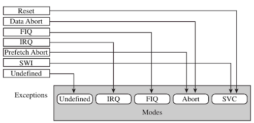
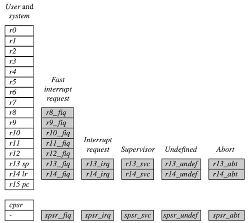
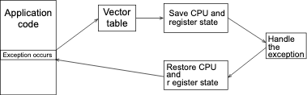
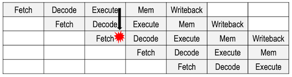

# 9 Exception and Interrupt Handling

> [ARM Developers: Exception handling process](https://developer.arm.com/documentation/dui0471/m/handling-processor-exceptions/exception-handling-process)

---

## 9.1 Exception Handling

**exception**이란, 정상적인 명령어 실행 시퀀스를 중단해야 하는 모든 condition을 의미한다.

- e.g., ARM core reset, memory access fail, undefined instruction, SWI, IRQ, FIQ 등

  > reset exception: 임베디드 시스템을 초기화하는 데 사용되는 특수한 예외

- 대부분의 예외는, 예외가 발생했을 때 실행되는 소프트웨어 루틴인 **exception handler**를 통해 처리된다.

---

### 9.1.1 ARM Processor Modes

ARM 코어는 특정한 예외가 발생하면, `cpsr[4:0]` 레지스터를 수정하여 **mode**를 변경한다.



| Exception | Mode | `cpsr[4:0]` | Main purpose |
| --- | --- | --- | --- |
| Fast Interrupt Request | **FIQ** | 10001 | fast interrupt request handling |
| Interrupt Request | **IRQ** | 10010 | interrupt request handling |
| SWI and Reset | **SVC** | 10011 | os를 protected mode로 전환 |
| Prefetch Abort and Data Abort | **Abort** | 10111 | virtual memory의 page fault 등 handling |
| Undefined Instruction | **Undefined** | 11011 | undefined instruction handling |

> **User** mode `cpsr[4:0]`: 10000, **System** mode `cpsr[4:0]`: 11111

예외가 발생하여 mode를 변경해야 하는 경우, ARM core에서는 다음 절차를 단계별로 수행한다.

> 

<table>
<tr>
<td> 



</td>
<td> 

| | |
| :---: | --- |
| (1) | 기존 `cpsr` $\rightarrow$ 진입 mode의 `spsr` 레지스터에 저장 |
| (2) | 기존 `pc` $\rightarrow$ 진입 mode의 `lr`에 저장 |
| (3) | `cpsr`: exception mode bit로 변경 |
| (4) | `pc`: exception handler 주소로 변경(vector table 참조) |

</td>
</tr>
</table>

---

## 9.2 Vector Table

각 예외에 대응되는 exception handler는 **vector table**이라는 메모리 영역에 기록되어 있다. (각 offset: 4 bytes 간격)

> 일반적으로 vector table의 base address는 `0x00000000`이나, 프로세서에 따라서 `0xffff0000`도 사용된다.

| Exception | Mode | Vector table offset |
| --- | --- | --- | 
| Reset | SVC | `+0x00` |
| Undefined Instruction | undefined | `+0x04` |
| Software Interrupt(SWI) | SVC | `+0x08` |
| Prefetch Abort | abort | `+0x0c` |
| Data Abort | abort | `+0x10` |
| Not assigned | - | `+0x14` |
| IRQ | IRQ | `+0x18` |
| FIQ | FIQ | `+0x1c` |

> 참고로 FIQ는 벡터 테이블의 마지막 항목이므로, 해당 주소에 exception handler를 직접 배치하는 방식으로 FIQ의 response time을 줄일 수 있다.

다음은 ARMv6의 벡터 테이블 구현에 해당되는 코드다.

```assembly
                AREA vectors, CODE, READONLY
                ENTRY
Vector_Table
                LDR pc, Reset_Addr
                LDR pc, Undefined_Addr
                LDR pc, SVC_Addr
                LDR pc, Prefetch_Addr
                LDR pc, Abort_Addr
                NOP                    ; Reserved vector
                LDR pc, IRQ_Addr
FIQ_Handler
                ; FIQ handler code - max 4kB in size
Reset_Addr      DCD Reset_Handler
Undefined_Addr  DCD Undefined_Handler
SVC_Addr        DCD SVC_Handler
Prefetch_Addr   DCD Prefetch_Handler
Abort_Addr      DCD Abort_Handler
IRQ_Addr        DCD IRQ_Handler
                ...
                END
```

---

### 9.2.1 Branching to Exception Handler

참고로 벡터 테이블에서 exception handler로 jump하는 코드는, 다음과 같이 여러 방식으로 구현할 수 있다.

| instruction | description |
| --- | --- |
| `B<address>` | pc-relative address(`pc + offset`)로 분기 |
| `LDR pc, [pc, #offset]` | indirect address jump<br>(overhead 있지만, 메모리 내 어느 주소나 분기 가능) |
| `LDR pc, [pc, #-0xff0]` | `0xfffff030` 주소에서 특정 interrupt service routine 적재<br>(VIC PL190 예시 / Vectored Interrupt Controller 있을 때만 가능) |
| `MOV pc, #immediate` | immediate를 `pc`에 복사 |

> (주의) `MOV pc, #immediate`: `MOV` 명령어의 특성상, immediate는 rotated right를 적용한 8-bit immediate에 해당된다. (3.1.1절 참조)

다음은 `LDR pc, [pc, #offset]` 명령어를 기반으로 구현한 벡터 테이블 구성 예시다. 

```assembly
0x00000000: 0xe59ffa38  RESET: > ldr  pc, [pc, #reset]
0x00000004: 0xea000502  UNDEF:   b    undInstr
0x00000008: 0xe59ffa38  SWI  :   ldr  pc, [pc, #swi]
0x0000000c: 0xe59ffa38  PABT :   ldr  pc, [pc, #prefetch]
0x00000010: 0xe59ffa38  DABT :   ldr  pc, [pc, #data]
0x00000014: 0xe59ffa38   -   :   ldr  pc, [pc, #notassigned]
0x00000018: 0xe59ffa38  IRQ  :   ldr  pc, [pc, #irq]
0x0000001c: 0xe59ffa38  FIQ  :   ldr  pc, [pc, #fiq]
```

---

## 9.3 Exception Priorities

예외는 동시에 발생할 수 있기 때문에, 프로세서는 우선순위 정책을 사용하여 exception을 처리한다.

| Priority | Exceptions | `I` bit | `F` bit |
| --- | --- | --- | --- |
| 1 | Reset | 1 | 1 |
| 2 | Data Abort | 1 | 1 | - |
| 3 | FIQ | 1 | 1 |
| 4 | IRQ | 1 | - |
| 5 | Prefetch Abort | 1 | - |
| 6 | Software Interrupt | 1 | - |
| 6 | Undefined Instruction | 1 | - |

> IRQ exception에서 `F` bit가 클리어되어 있을 경우, 도중에 1로 세트되면서 FIQ 예외로 넘어갈 수 있다.

---

### 9.3.1 Reset Exception

**reset exception**은 최우선 우선순위를 갖는 예외로, 전원이 공급되면 제일 먼저 시스템을 초기화하기 위해 수행되는 예외이다.

> 오류를 방지하기 위해, Interrupt 활성화 전에 수행해야 한다.

---

### 9.3.2 Data Abort Exception

MMU(Memory Management Unit)에서 접근 불가능한 메모리 주소를 참조할 때 발생한다.

- (1) reserved space에 접근

- (2) 할당되지 않은 메모리 주소에 접근(page fault)

  > virtual memory 상에 존재하지만, 실제 physical memory는 없는 경우

참고로 data abort 예외 처리 중 FIQ 예외가 비활성화되지 않으며, 도중에 FIQ 예외가 발생하면 이를 처리할 수 있다.

> 도중에 control이 FIQ handler로 넘어간 뒤, 끝나면 다시 data abort handler로 돌아온다.

| $t_1$ | $t_2$ | $t_3$ | 가능 여부 |
| :---: | :---: | :---: | :---: |
| data abort | **FIQ** | data abort | O |

---

### 9.3.3 Fast Interrupt Request Exception

가장 높은 우선순위를 갖는 interrupt로, 빠른 응답이 필요한 상황에서 사용된다.

- 조건: `cpsr` `F` bit가 0일 때만 FIQ 예외가 발생한다. 

- 예외 진입 시 `I`, `F` bit를 모두 set하면서, 외부 인터럽트를 비활성화시킨다.

  즉, `I`, `F` bit를 다시 활성화하지 않는 이상, 외부 소스에서 interrupt를 발생시킬 수 없다. 

> (nested interrupt) 도중 FIQ 내부에서 bit를 다시 0으로 끄게 되는데, 이때부터는 보다 높은 우선순위의 FIQ가 선점할 수 있다. 

다음은 FIQ 도중 다른 interrupt가 발생한 상황 예시다.

| $t_1$ | $t_2$ | $t_3$ | 가능<br/>여부 |
| :---: | :---: | :---: | :---: | 
| FIQ 1 | FIQ 2 | FIQ 1 | X |
| FIQ | IRQ | FIQ | X | 

---

### 9.3.4 Interrupt Request Exception

FIQ와 마찬가지로 external peripherial set에 의해 발생하는 interrupt로, FIQ보다는 낮은 우선순위를 갖는다.

- 조건 1: `cpsr` `I` bit가 0일 때만 IRQ 예외가 발생한다.

- 조건 2: FIQ 혹은 data abort를 수행하고 있지 않을 때 발생한다.

- 예외 진입 시 `I` bit를 set하면서, 외부 인터럽트가 비활성화된다.

| $t_1$ | $t_2$ | $t_3$ | 가능<br/>여부 | 
| :---: | :---: | :---: | :---: |
| IRQ 1 | IRQ 2 | IRQ 1 | X | 

> (nested interrupt) 높은 우선순위의 IRQ 1이 실행 중일 때, IRQ 2는 실행이 불가능하다. (반대로 IRQ 2 실행 중 IRQ 1은 실행이 가능하다.) 

----

### 9.3.5 Prefetch Abort Exception

파이프라인에서 명령어를 prefetch하는 도중, memory fault 문제가 있을 경우 발생한다.

- 조건: 상위 예외가 발생하지 않은 상태에서만 발생한다.

- `I` bit를 set하여, 외부 인터럽트가 비활성화된다.



---

### 9.3.6 Software Interrupt Exception

`SWI` 명령에 의해 발생하는 예외로, 상위 예외가 발생하지 않은 상태에서만 발생한다.

- `cpsr`: supervisor mode로 변경된다.

단, 다음과 같이 SWI가 중첩되는 상황에서는 수동으로 `spsr`, `lr`을 백업하는 코드를 작성해야 한다.

| $t_1$ | $t_2$ | $t_3$ | 
| :---: | :---: | :---: | 
| SWI 1 | SWI 2 | SWI 2 | 

> nested SWI e.g., 가상 머신 하이퍼바이저에서 SWI 명령어 사용, 디버깅 등
>
> > debugger: 코드 한 줄마다 `SWI` 명령을 수행하면서, control을 가져가는 방식으로 구현된다.

---

### 9.3.7 Undefined Instruction Exception

ARM 명령어가 아닌 명령어를 실행하거나, Thumb 명령어가 파이프라인의 Execute 단계에 진입했을 때 발생한다.

- 조건: 동일한 우선순위인 Software Interrupt 예외와 동시에 발생할 수 없다.

- coprocessor가 있으며 해당 명령어를 다룰 수 있다면, Execute 단계에서 decode를 수행하게 된다.

---

## 9.4 Link Register Offsets

예외 발생 시, **link register**(`lr`)에는 예외를 처리한 뒤 다시 실행할 명령어 주소가 저장된다. 

> `r14_irq = pc`처럼 `pc`를 그대로 사용하지 않고, 다음과 같이 보정해야 한다.

- e.g., IRQ handler

  IRQ는 <U>명령어가 Execute된 다음에 발생</U>하므로, `lr - 4`로 보정한다.

  ```assembly
  instruction 1    ; <--- (마지막으로 Execute된 명령어)
  instruction 2    ; IRQ 예외 발생(lr - 4)
  instruction 3    ; <--- (Fetch) lr(pc)
  ```
다음은 각 예외마다 `lr`에 담기는 return address를 정리한 도표다.

| Exception | Address |  |
| --- | --- | --- |
| Reset | - | `lr`이 정의되지 않는다 |
| Data Abort | `lr - 8` | 기존에 Execute가 온전히 실행되지 않았으므로, 다시 실행 |
| FIQ | `lr - 4` |  |
| IRQ | `lr - 4` |  |
| Prefetch Abort | `lr - 4` | Prefetch Abort exception이 발생한 명령어 |
| SWI | `lr` | `SWI` 명령어의 바로 다음 명령어 |
| Undefined Instruction | `lr` | undefined 명령어의 바로 다음 명령어 |

---

### 9.4.1 Returning From Handler

다음은 FIQ, IRQ handler에서, stack을 사용하지 않고 return을 수행하는 두 가지 구현이다.

> `SUBS`, `MOVS` 명령어에서 `pc`가 destination 레지스터일 경우, `spsr` 레지스터 값을 `cpsr` 레지스터로 복구시킨다.

<table>
<tr>
<td> Assembly 1 </td> <td> Assembly 2</td>
</tr>
<tr>
<td> 

```assembly
handler
            <handler code>
            ...
            SUBS    pc, r14, #4 ; pc=r14-4, return


```

</td>
<td> 

```assembly
handler
            SUB     r14, r14, #4 ; pc=r14-4
            ...
            <handler code>
            ...
            MOVS    pc, r14      ; return
```

</td>
</tr>
</table>

---

### 9.4.2 Returning From Handler: Using Stack

다음은 interrupt stack을 사용하여 link register를 저장하는 구현이다.

- hat(`^`) symbol: `spsr` 레지스터 값을 `cpsr` 레지스터로 강제로 복구시킨다.

```assembly
handler
          SUB     r14, r14, #4             ; 저장할 때 -4 먼저 빼고 저장
          STMFD   r13!,{r0-r3, r14}        
          ...
          <handler code>
          ...
          LDMFD   r13!,{r0-r3, pc}^        ; return
```

--- 