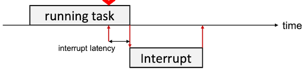
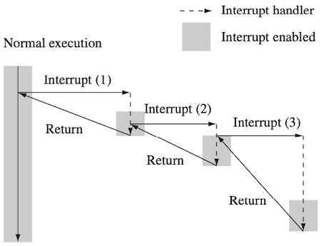
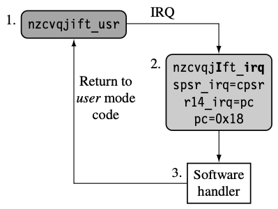
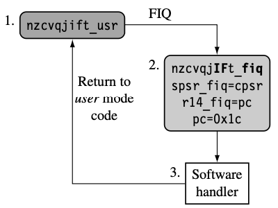
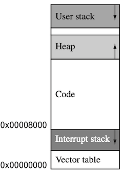
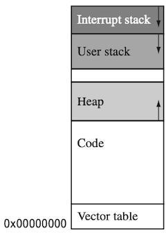
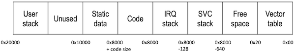

# 9 Exception and Interrupt Handling

---

## 9.5 Interrupts

예외의 한 종류인 **Interrupt**는 발생 원인에 따라 두 종류로 나뉜다.

| 종류 | 원인 | 관련 예외 |
| --- | --- | --- |
| **External Interrupt** | 외부의 주변장치에 의해 발생 | IRQ(periodic timer처럼 일반적인 인터럽트)<br/>FIQ(빠른 응답 시간이 필요한 특수한 인터럽트) |
| **Internal Interrupt** | 명령어에 의해 발생 | SWI(OS의 privileged routine을 수행하기 위함) |

> FIQ는 레지스터를 더 많이 사용하므로, IRQ보다 빠른 응답 시간을 가진다.

이때 interrupt latency는 하드웨어와 소프트웨어 양쪽의 영향을 받는다. (따라서, 최적화를 위해서는 양쪽을 모두 고려해야 한다.)

- **interrupt latency**: interrupt 요청부터 interrupt 처리를 시작하기까지의 시간 (그림의 $\leftrightarrow$ 구간)

  

> 참고로 multiple register transfer 명령어는 interrupt latency가 매우 길기 때문에 주의가 필요하다.

---

### 9.5.1 Minimize Interrupt Latency (Software Handler)

다음은 interrupt latency를 소프트웨어 관점에서 최적화하는 두 가지 방법이다.

-  **nested interrupt handler**: 인터럽트 발생 중 다른 인터럽트의 발생을 허용한다.

   > 새 인터럽트 처리 후, 다시 원래의 인터럽트의 남은 부분을 처리한다.

   

-  **prioritization**: 우선순위를 적용하여, 우선순위가 높은 인터럽트만 nested interrupt를 허용한다.

---

### 9.5.2 IRQ and FIQ Exception

다음은 IRQ, FIQ 인터럽트가 발생했을 때의 프로세스 루틴을 나타낸 도표다.

| | IRQ | FIQ |
| --- | --- | --- |
| |  |  |
| (1) | IRQ 모드로 진입한다.(`nzcvqiIft_irq`) | FIQ 모드로 진입한다.(`nzcvqiIFt_fiq`) |
| (2) | `cpsr`를 새 IRQ 모드의 `spsr`에 저장(백업)한다. | (동일) |
| (3) | `pc` 값을 새 IRQ 모드의 `lr`에 저장한다. | (동일) |
| (4) | 다른 interrupt를 비활성화한다. (`I` bit set) | (동일) (`F`, `I` bit set) |
| (5) | 벡터 테이블의 특정 entry로 점프한다.(`0x18`) | (동일) (`0x1c`) |

---

#### 9.5.2.1 Enabling and Disabling Interrupts

인터럽트의 활성화 혹은 비활성화에서 사용하는 명령어는 다음과 같다.

- `MRS{cond} rd, psr`: `cpsr` 혹은 `spsr` 내용을 레지스터에 저장

- `MSR{cond} psr_fields, rm`: 레지스터 내용을 `cpsr` 특정 필드에 복사

  > `cpsr[7:0]`처럼 필드의 특정 위치를 대상으로 직접 수정할 수 있다.(=`cpsr_c`)

  > | cpsr_field | |
  > | --- | --- |
  > | `cpsr_c` | `cpsr[7:0]` |
  > | `cpsr_x` | `cpsr[15:8]` |
  > | `cpsr_s` | `cpsr[23:16]` |
  > | `cpsr_f` | `cpsr[31:24]` |

다음은 IRQ, FIQ 인터럽트를 활성화 혹은 비활성화하는 코드 예시다.

- pipeline에서 MSR 명령어가 execute stage에서 처리된 후, 비로소 활성화 혹은 비활성화가 반영되므로 유의해야 한다.

<table>
<tr>
<td>  </td> <td> IRQ </td> <td> FIQ </td>
</tr>
<tr>
<td> Enabling </td> 
<td> 

```assembly
PRE  nzcvqjIFt_SVC

enable_irq
        MRS     r1, cpsr
        BIC     r1, r1, #0x80
        MSR     cpsr_c, r1

POST nzcvqjiFt_SVC
```

</td>
<td> 


```assembly
PRE  nzcvqjIFt_SVC

enable_fiq
       MRS     r1, cpsr
       BIC     r1, r1, #0x40
       MSR     cpsr_c, r1

POST nzcvqjIft_SVC
```

</td>
</tr>
<tr>
<td> Disabling </td> 
<td> 

```assembly
PRE  nzcvqjift_SVC

disable_irq
        MRS     r1, cpsr
        ORR     r1, r1, #0x80
        MSR     cpsr_c, r1

POST nzcvqjIft_SVC
```

</td>
<td> 


```assembly
PRE  nzcvqjift_SVC

disable_fiq
        MRS     r1, cpsr
        ORR     r1, r1, #0x40
        MSR     cpsr_c, r1

POST nzcvqjiFt_SVC
```

</td>
</tr>
</table>

---

## 9.6 Interrupt Stack Design

exception handler는 예외 처리 과정에서 **stack**을 사용하며, 각 모드마다 stack을 따로 사용하기 위해 stack pointer를 담은 전용 레지스터를 갖는다. 

그러나 이때, 타겟 하드웨어나 운영 체제에 따라서 stack의 설계 방식이 다르기 때문에 주의해야 한다.

- OS Requirement: OS에서 요구하는 stack size. (e.g., stack을 사용한 context switch)

  > nested interrupt 시, 더 큰 stack size가 필요하다.

- Target Hardware: 타겟 하드웨어에 따라 **stack size**나 **location**이 다를 수 있다.

  > 특히, 아키텍처에 따라서 stack이 자라는 방향이 다를 수 있다. (e.g., ARM: stack은 높은 주소부터 아래로 자란다.)

> 스택은 크게 두 종류(kernel stack, user stack)로 나뉜다. 
>
> | 스택 | 목적 | 상세 |
> | --- | --- | --- |
> | **kernel stack** | 주로 context switch 목적으로 사용 | |
> | **user stack** | 주로 함수 호출 목적으로 사용 | function(main)과 frame record를 저장한다.<br>(메모리 경계를 가리키는 것이 frame pointer) |

---

### 9.6.1 Stack Overflow

만약 stack 공간을 부적절하게 할당할 경우, **stack overflow**에 의한 메모리 손상이 발생할 수 있다.

|| Case A<br/>code section 아래 Interrupt stack | Case B<br/>메모리 최상단 (user stack 위) |
| :---: | :---: | :---: |
||  |  |
| 손상 시 | vector table 손상 (fatal error) | user stack 손상 (시스템 복구 가능) |

---

### 9.6.2 Basic Stack Design

> 모든 processor mode의 stack setup은 processor의 reset마다 수행된다.

다음은 9.6.1절의 'Case A' layout 예시의 stack 설정이다.


<table>
<tr>
<td>  </td> 
</tr>
<tr>
<td> 



</td>
</tr> 
<td> 

```assembly
USR_Stack   EQU 0x20000         ; user stack의 주소 설정: 0x20000
IRQ_Stack   EQU 0x8000        
SVC_Stack   EQU IRQ_Stack-128   ; Supervisor stack의 주소 설정
                                ; IRQ stack부터 아래로 128바이트 떨어진 곳
```

</td>
</tr>
</table>

이때 각 processor mode마다 고유한 bit pattern을 가지며, 이를 통해 mode를 구분한다.

> `cpsr[4:0]`을 수정하여 모드를 전환한다.

```assembly
Usr32md    EQU 0x10    ; User mode
FIQ32md    EQU 0x11    ; FIQ mode
IRQ32md    EQU 0x12    ; IRQ mode
SVC32md    EQU 0x13    ; Supervisor mode
Abt32md    EQU 0x17    ; Abort mode
Und32md    EQU 0x1b    ; Undefined instruction mode
Sys32md    EQU 0x1f    ; System mode
```

참고로 안전을 위해, 초기화 과정에서는 IRQ와 FIQ를 비활성화한다. (No Interrupt)

```assembly
NoInt      EQU 0xc0    ; I and F bit set
```

---
