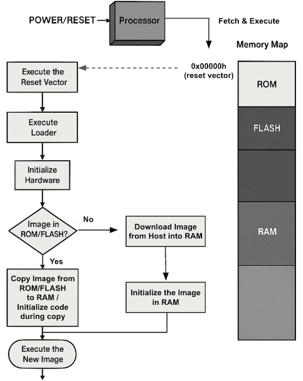
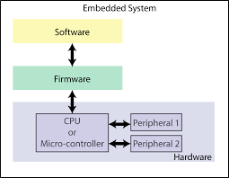
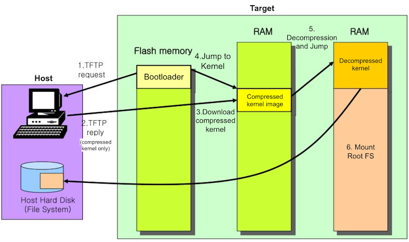
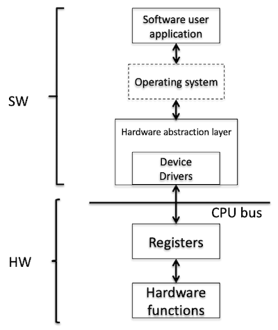
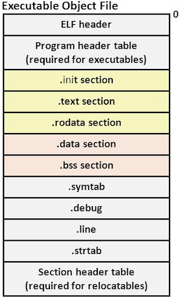
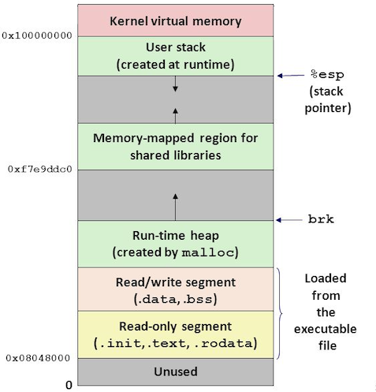

# 10 Firmware

임베디드 하드웨어에 전원이 공급되면, CPU는 제일 먼저 ROM에 reside하는 펌웨어(**firmware**)부터 실행한다.

| No. | Sequence |
| --- | --- |
| 1 | CPU power on |
| 2 | Reset to processor |
| 3 | (processor read) points to ROM |

---

## 10.1 Firmware

펌웨어란 하드웨어와 OS(or Application) 소프트웨어 사이의 interface를 돕는 저레벨(low-level) 소프트웨어다. OS의 load 및 boot 과정에서 안정적인 동작을 보장하는 것을 주된 목적으로 한다.

복잡한 OS의 load, boot 과정을 돕는 펌웨어부터, 작은 microkernel을 load하는 펌웨어까지 다양하게 존재한다. 펌웨어는 일반적으로 다음 단계로 실행된다.

(1) Set up target platform $\rightarrow$ (2) Abstract the hardware $\rightarrow$ (3) Load a bootable image $\rightarrow$ (4) Relinquish control(제어권 양도)

> BIOS(Basic Input/Output System), UEFI(Unified Extensible Firmware Interface)도 펌웨어의 일종이다. (참고로 여러 펌웨어를 가질 수 있다.)

> | Terminology | Description |
> | --- | --- |
> | platform | SW가 실행되는 환경(하드웨어 아키텍처, OS, 프로그래밍 언어, 런타임 라이브러리 등 포함) |
> | kernel | OS의 핵심 프로그램으로, 하드웨어와 소프트웨어 간의 interface 역할을 한다. |

---

### 10.1.1 Bootloader

> Trivial File Transfer Protocol(TFTP): bootloader가 OS image를 다운로드하는 데 사용하는 프로토콜

다음은 TFTP를 활용하는 임베디드 시스템 개발 환경이다. Host PC에서 TFTP 서버를 실행하면, 부팅 시 target board의 TFTP 클라이언트를 통해 kernel image를 다운로드한다.

여기서 **bootloader**란 OS를 target hardware에 설치하기 위한 application을 의미한다. 이러한 bootloader는 일반적으로 펌웨어에 포함되며 OS(or app)이 실행될 때까지만 존재한다.

---

## 10.2 Firmware Execution Flow

다음은 펌웨어의 실행 단계별 기능을 정리한 도표다.

| Stage | Features |
| --- | --- |
| (1) **Set up target platform** | HW system register 프로그래밍 플랫폼 확인 진단(Diagnostic) 디버그(Debug) 인터페이스 Command Line Interpreter(CLI) |
| (2) **Abstract the hardware** | Hardware Abstraction Layer(HAL) Device driver | 
| (3) **Load a bootable image** | Basic file system | 
| (4) **Relinquish control** | `pc`가 image를 가리키도록 수정 |

---

## 10.3 Set Up Target Platform

> control register: interrupt, addressing mode, coprocessor 제어 등 다양한 기능을 수행한다.

OS가 작동하기 전에는 특정한 타입의 환경이 필요하며, 현재 단계에서는 target platform이 올바르게 초기화되었는지 확인한다. 다음은 target platform 설정 시 수행하는 작업의 예시다.

- memory map을 원하는 레이아웃으로 설정

- 실행 파일이 여러 core, platform에서 작동할 수 있도록 core 정보 확인 (coprocessor 레지스터 `CP15`를 읽는 것이 일반적)

- (마이크로컨트롤러의) control registers가 적절한 주소로 매핑되어 있는지 확인

여기서 진단(diagnostic)은 하드웨어의 불량을 확인하는 작업이며, 디버깅(debugging)은 하드웨어에서 실행되는 소프트웨어를 확인하는 작업이다. 

| Feature | Description |
| --- | --- |
| Diagnostic | 하드웨어의 불량 여부를 확인 대체로 HW dependent하다. |
| Debugging | 하드웨어에서 실행되는 소프트웨어를 확인 CLI나 전용 host debugger를 활용하여 명령을 전달한다. |

---

## 10.4 Abstract the Hardware

> [(lecture slide) Embedded systems: Hardware Abstraction Layer](https://www.uio.no/studier/emner/matnat/fys/FYS4220/h22/lecture-slides/embedded_hal.pdf)

하드웨어 추상화(**hardware abstraction**)란, 하드웨어 자원에 대한 접근을 흉내내는 소프트웨어를 의미한다.

**Hardware Abstraction Layer**(HAL)란, 컴퓨터의 하드웨어와 소프트웨어 사이에 존재하는 추상화 계층을 의미한다. 이를 통해 하드웨어의 차이를 숨기면서 소프트웨어가 하드웨어에 독립적으로 동작할 수 있다.

> target platform이 바뀌어도 HAL programming interface는 동일하다.

여기서 특정 peripheral과 통신하는 HAL software를 **device driver**라고 지칭한다. 읽기/쓰기를 위한 Application Programming Interface(API)를 제공한다.

> 예를 들어 하드 드라이브와 같은 미디어 장치를 사용하려면, HW 액세스를 위한 device driver가 펌웨어에 포함되어야 한다.

---

## 10.5 Load a bootable image

해당 단계에서 펌웨어는 OS(or App) image를 RAM에 복사한다. 

> 모든 image가 RAM에 복사되는 것은 아니다. (ROM에서 in-place로 직접 실행 가능)

이때 펌웨어는 OS(or App) image를 load하기 위한 기본적인 file system을 제공해야 한다. 예를 들면 flash memory에서 파일 시스템을 사용하기 위한 **Flash File System**(FFS)가 대표적이다.

펌웨어는 FS을 읽어서 image 파일을 찾은 뒤 메모리에 복사하게 된다. 만약 image를 네트워크에서 전달 받는다면 네트워크 프로토콜 정보를 포함하고 있어야 한다.

---

### 10.5.1 Example of Image Format

> [Intrinsoft: Binary File Types (Executable, Shared library and Relocatable) and Relocation](https://www.youtube.com/watch?v=3bNMm4D5AlM)

펌웨어가 image를 load하는 절차는 이미지 형식에 따라 다르다.
  
| image type |  |
| --- | --- |
| `plain binary` | header나 debug 정보가 없는 가장 기본적인 이미지 형식 |
| `ELF`(Executable & Linkable Format) | ARM-based, UNIX 시스템에서 널리 사용되는 이미지 형식 |
  
ELF는 원래 UNIX 시스템용으로 개발되었으며, 바이너리 파일을 세 가지 타입으로 분류할 수 있다.

| Type | Examples |
| --- | --- |
| Executable | OS의 표준 실행 바이너리(`ls`, `cd`, `mv`, `cp` 등) |
| Relocatable | object file(`.o`) |
| Shared Object | 동적 라이브러리(`.so`) |

ELF image를 load하기 위해서는 standard ELF header 정보(실행 주소, 유형, 크기 등)를 해독(deciphering)해야 한다. 만약 image가 암호화(encrypted) 혹은 압축(compressed)되어 있다면, decryption이나 decompression 같은 작업도 포함된다.

---

### 10.5.2 Loading the Image

> MicroC/OS image를 예로 들면, code section은 RAM에 적재되지 않고 ROM에서 in-place로 실행된다.

이때 image를 RAM에 load하는 과정에서 section의 일부만 복사하게 된다. `.init`, `.text`, `.rodata`, `.data`, `.bss`를 load하며, 경우에 따라서는 전체를 load 없이 ROM에서 직접 실행할 수 있다.

| Executable Object File | Memory Space(Loaded) |
| :---: | :---: |
|  |  |

| Section | Description |
| --- | --- |
| `.text` | read-only data (executable code 혹은 const data) |
| `.data` | read-write data (컴파일 중 정적 초기화를 거친 non-zero value) |
| `.bss` | read-write data (zero-initialized) |

---

## 10.6 Relinquish control

모든 단계가 끝나면 펌웨어는 제어권을 OS(혹은 App)에 양도한다. 이는 vector table을 업데이트하고 `pc`를 수정하는 작업을 의미한다. 

- **vector table**: exception 및 interrupt vector를 해당 OS handler에 맞게 업데이트한다.

- `pc`: OS entry point address를 가리키도록 수정한다.

---